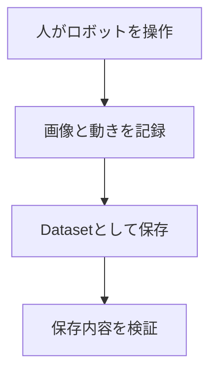

# ALOHAではじめるロボットデータ収集

この教材では、組み立て済みのALOHAを使って、次の一連の作業を学びます。



想定読者は、研究室へ配属されて初めてロボットを扱う学生です。ロボット、ALOHA、LeRobot、ROS 2を知っている必要はありません。Linuxのターミナルでコマンドを実行した経験が少しあれば始められます。

本教材が扱うのは、組み立て完了後のsoftware環境構築、Teleoperation、データ収集、および外部sensorの追加です。Armやcameraの取り付けなど、ハードウェアの組み立て作業は対象に含みません。

## 最初にすること

### 1. ALOHAの組み立て状態と部品構成を確認する

ALOHAがまだ組み立てられていない場合や、機器の配置・配線を確認したい場合は、最初にTrossen Robotics公式のHardware Setupを参照してください。

- [Trossen Robotics: Hardware Setup](https://docs.trossenrobotics.com/trossen_arm/main/getting_started/hardware_setup.html)

実機を見ながら、次の部品が揃っていることを確認してください。

- 人が手で動かす2台のLeader Arm
- 対象物を操作する2台のFollower Arm
- 各ArmにつながるArm Controller
- 4台のControllerをPCにつなぐEthernet switch
- 上方、低位置、左右手首の4台のcamera

それぞれの部品の役割や、人が操作するLeader Armと対象物を操作するFollower Armの関係は、次の00で説明します。

すでに組み立てが完了している場合は、Hardware Setupを最初から実行する必要はありません。部品構成を確認したら、00へ進んでください。

### 2. 00から順に読む

初めての人は、次の順序で進んでください。

| 順番 | 教材 | 読み終えたときにできること |
|---|---|---|
| 00 | [最初に知ること](docs/00_concepts_and_terminology.md) | ALOHAが何をする装置か、操作からデータ保存までを説明できる |
| 01 | [使用するソフトウェア](docs/01_reference_stack.md) | Trossen、LeRobot、`lerobot_trossen`の役割を区別できる |
| 02 | [最初のデータ収集](docs/02_data_collection.md) | 実機を確認し、短いdemonstrationを1 episode収録できる |
| 03 | [外部センサの追加](docs/03_architecture_and_extension.md) | 新しいsensorをどこへ、どのように接続するか考えられる |

途中で問題が起きたら、[04 Troubleshooting](docs/04_troubleshooting.md)を使います。softwareやhardwareを変更するときは[05 Maintenance](docs/05_maintenance.md)、この構成で実際に確認済みの値や挙動を知りたいときは[06 実機検証結果と正常性の判断](docs/06_validation_results.md)を参照してください。

## この教材の読み方

本文には3種類の情報があります。

### やること

利用者が実際に行う操作です。コマンドを実行する前に、その節の「何を確認するか」を読んでください。

### 仕組み

今行った操作が、システムのどの部分に働いているかを説明します。最初は完全に理解できなくても構いません。

### 完了条件

次へ進んでよい状態を示します。コマンドが終了したことだけでなく、表示や実機の動きを確認します。

分からない用語をすべて調べてから進む必要はありません。具体的な作業の中で一度使い、その後に説明へ戻る方が理解しやすい構成になっています。

## 最初の到達点

最初の目標は、例えば次の10秒程度の作業を記録することです。

> 左右のLeader Armを使い、Follower Armでblockを持ち上げ、隣のtrayへ置く。

収録後、以下が一つのepisodeとして保存されます。

保存されるのは、4台のcamera画像、左右Follower Armの状態、人が与えた操作指令、task名と時刻情報である。

最後にvalidatorを実行し、数値data、video、metadataが対応していることを確認します。ここまで通れば、ALOHAの基本的なdata collectionの全体像を実体験したことになります。

## 正常に動いているかを判断する

本教材では、各作業の直後に完了条件を示します。加えて、06には検証環境で得られたframe数、control rate、sensor rate、alignment ageなどを記録しています。

実測値は完全一致させる目標値ではありません。次のように使います。

- 同じ10秒収録なのにframe数が極端に少ない → cameraや処理負荷を調べる
- target 30 fpsに対して実測が大きく低い → USB帯域、decode、保存負荷を調べる
- causal alignmentでfuture sampleが1以上 → timestampまたはalgorithmを見直す
- validatorがPASSでも映像が遮蔽されている → demonstrationの内容を目視確認する

[06 実機検証結果と正常性の判断](docs/06_validation_results.md)は、単なる実施報告ではなく、自分の環境の結果を解釈するために使用します。

## 困ったときに自分で調べるための地図

問題を調べるときは、まずどの層で起きているかを考えます。

| 確認する層 | 問い |
|---|---|
| 物理 | 電源、cable、USB、Ethernetは正しいか |
| Device | OSからArmやcameraが見えるか |
| Driver | softwareからdataを読めるか |
| Application | teleoperationやrecordingが動くか |
| Data | Datasetの中身が正しいか |

例えば、cameraがOSから認識されていないならLeRobotの設定だけを直しても解決しません。逆にOSからcameraが見えているなら、serial numberやrecording設定を確認します。この切り分けができるようになることを、本教材の最終的な学習目標とします。

## 検証済みの構成

```text
TrossenRobotics/lerobot_trossen
commit:          a4336933f34192a3daa7e9fb52674284bb5ae48e
LeRobot:         0.6.0
Python:          3.12
Dataset:         LeRobotDataset v3.0
OS:              Ubuntu 24.04
```

このversionを使う理由は01で説明します。最新版へ置き換える場合は、05に従って再検証してください。

## 付属sensor toolの仕様

00〜06が利用者向け資料の本体であり、環境構築、収録、正常性判断に必要な説明はこの中で完結する。外部sensor用の付属scriptを実際に使用するときだけ、次のCLI仕様を参照する。

- [Custom Sensor Script Reference](examples/custom_sensor/README.md)
- [Asynchronous Camera Reference](examples/custom_sensor/camera/README.md)

実施内容や納品時の検証記録は`reports/`に分離しています。通常の利用者が環境構築を行うために読む必要はありません。
