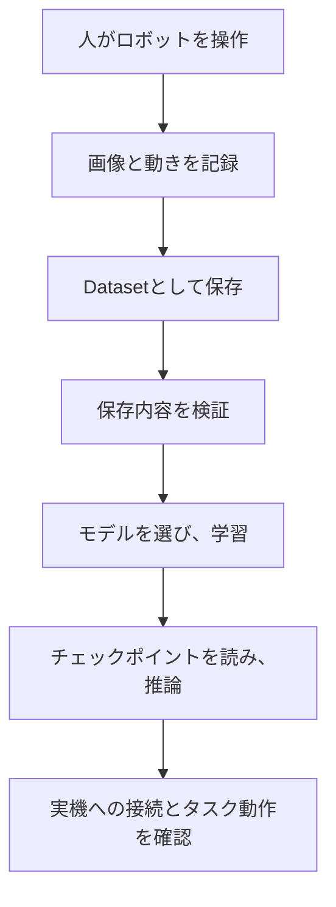

# ALOHAではじめるロボットデータ収集とVLA

この教材では、組み立て済みのALOHAを使い、操作・データ収集からVLAモデルの学習と推論までを学びます。機器を扱ったことのない人が公式資料を参照しながら作業を通し、その後、自分の研究目的に応じたモデルと拡張先を選べるようにします。


```mermaid
flowchart TD
    A["人がロボットを操作"] --> B["画像と動きを記録"]
    B --> C["Datasetとして保存"]
    C --> D["保存内容を検証"]
    D --> E["モデルを選び、学習"]
    E --> F["チェックポイントを読み、推論"]
    F --> G["実機への接続とタスク動作を確認"]
```

想定読者は、研究室へ配属されて初めてロボットを扱う学生です。ロボット、ALOHA、LeRobot、ROS 2を知っている必要はありません。Linuxのターミナルでコマンドを実行した経験が少しあれば始められます。ALOHAの使用経験がある人の立会いを前提にせず、一人で設定・収録・学習・推論を進める順序で説明します。

本教材は組み立て完了後のsoftware環境構築、Teleoperation、データ収集、外部sensorの追加、VLAの選び方と初回学習・オフライン推論を扱います。Armやcameraの取り付けなどハードウェアの組み立ては対象に含みません。SmolVLAとLeRobot版π₀.₅は実機側の非同期推論まで確認し、接続時の調整とタスク結果を[11](docs/11_robot_policy_execution.md)に記録しています。

## 最初にすること

### 1. ALOHAの組み立て状態と部品構成を確認する

ALOHAがまだ組み立てられていない場合や、機器の配置・配線を確認したい場合は、最初にTrossen Robotics公式のHardware Setupを参照してください。

- [Trossen Robotics: Hardware Setup](https://docs.trossenrobotics.com/trossen_arm/main/getting_started/hardware_setup.html)

実機を見ながら、次の部品が揃っていることを確認してください。

- 人が手で動かす2台のLeader Arm
- 対象物を操作する2台のFollower Arm
- 各ArmにつながるArm Controller
- 4台のControllerをPCにつなぐEthernet switch
- 上方、低位置、左右手首の4台のcamera

それぞれの部品の役割や、人が操作するLeader Armと対象物を操作するFollower Armの関係は、次の00で説明します。

すでに組み立てが完了している場合は、Hardware Setupを最初から実行する必要はありません。部品構成を確認したら、00へ進んでください。

### 2. 目的に合わせて読む

初めて収録から学習・実機接続まで進む場合は、**00 → 01 → 02 → 07の第1・2節 → 08 → 11**を基本の順序にします。08は自分のデータによる学習・オフライン推論、11は公式の実機接続手順に対して実機検証で必要だった差分と結果を扱います。11では入力・推論環境・指令制限を順に確認し、付属scriptで実行条件を保存して起動します。対象機体の公式手順とも照合してください。短い接続確認用の学習と、実機検証に用いた20K学習は区別してください。

| 教材 | 読む場面 |
|---|---|
| [00 最初に知ること](docs/00_concepts_and_terminology.md) | ALOHAの部品と、操作・収録・学習の関係を知る |
| [01 使用するソフトウェア](docs/01_reference_stack.md) | 基準のソフトウェアと固定版を確認する |
| [02 最初のデータ収集](docs/02_data_collection.md) | 環境を準備し、収録・Dataset検証まで通す |
| [07 VLAを選ぶための基礎と研究への入口](docs/07_vla_model_selection.md) | 学習前にモデルと実行系を区別する。後半の論文紹介は必要に応じて読む |
| [08 自分のデータで学習・オフライン推論](docs/08_vla_training_inference.md) | 保存・再読込まで学習経路を確かめる。実機成功例を入口にするなら第3節のSmolVLAから始める |
| [11 学習済みVLAの実機接続と動作確認](docs/11_robot_policy_execution.md) | 実機側の環境・制御設定・終了動作と、成功・失敗の実例を照合する |

目的に応じて次の資料を使います。すべてを順に実行する必要はありません。

| 目的 | 参照先 |
|---|---|
| 外部センサを収録・同期したい | [03 外部センサの追加](docs/03_architecture_and_extension.md) |
| 作業が途中で止まった、動作を切り分けたい | [04 Troubleshooting](docs/04_troubleshooting.md) |
| 環境・ハードウェア・モデル設定を変更したい | [05 Maintenance](docs/05_maintenance.md) |
| 収録・センサ同期の測定値を解釈したい | [06 収録・同期の検証結果](docs/06_validation_results.md) |
| OpenVLA-OFTの専用実行系へデータを渡したい | [09 データ変換・学習・推論](docs/09_openvla_oft_data_bridge.md) |
| 案件に合う構成やセンサ拡張を検討したい | [10 構成選定とセンサ拡張](docs/10_stack_decisions_and_extension.md)。モデルを選ぶ前は第1・2節、拡張前は第3・4節を参照 |

ファイル番号は資料の識別に使います。実習と参照資料を上の順序で使い分けてください。

## この教材の読み方

本文には3種類の情報があります。

### やること

利用者が実際に行う操作です。コマンドを実行する前に、その節の「何を確認するか」を読んでください。

### 仕組み

今行った操作が、システムのどの部分に働いているかを説明します。最初は完全に理解できなくても構いません。

### 完了条件

次へ進んでよい状態を示します。コマンドが終了したことだけでなく、表示や実機の動きを確認します。

分からない用語をすべて調べてから進む必要はありません。具体的な作業の中で一度使い、その後に説明へ戻る方が理解しやすい構成になっています。

## 最初の到達点

最初の目標は、例えば次の10秒程度の作業を記録することです。

> 左右のLeader Armを使い、Follower Armでblockを持ち上げ、隣のtrayへ置く。

収録後、以下が一つのepisodeとして保存されます。

保存されるのは、4台のcamera画像、左右Follower Armの状態、人が与えた操作指令、task名と時刻情報である。

最後にvalidatorを実行し、数値data、video、metadataが対応していることを確認します。ここまで通れば、ALOHAの基本的なdata collectionの全体像を実体験したことになります。02の最後にVLA実習用の`aloha_vla_demo`を収録し、07で候補を選び、08で収録形式とモデルが要求する入力を照合して、短い学習、保存済みcheckpointの再読込、オフライン推論を試します。教材の短い学習はロボットのタスク成功を保証するものではありません。

## 正常に動いているかを判断する

本教材では、各作業の直後に完了条件を示します。06には収録環境で得られたframe数、control rate、sensor rate、alignment age、08には収録済みデータから学習・checkpoint再読込・オフライン推論を確認した条件を記録しています。学習の確認に使用したGPUは08、実機側の推論環境と2モデルのタスク結果は11に明記しています。

実測値は完全一致させる目標値ではありません。次のように使います。

- 同じ10秒収録なのにframe数が極端に少ない → cameraや処理負荷を調べる
- target 30 fpsに対して実測が大きく低い → USB帯域、decode、保存負荷を調べる
- causal alignmentでfuture sampleが1以上 → timestampまたはalgorithmを見直す
- validatorがPASSでも映像が遮蔽されている → demonstrationの内容を目視確認する

[06 実機検証結果と正常性の判断](docs/06_validation_results.md)は、単なる実施報告ではなく、自分の環境の結果を解釈するために使用します。

## 困ったときに自分で調べるための地図

問題を調べるときは、まずどの層で起きているかを考えます。

| 確認する層 | 問い |
|---|---|
| 物理 | 電源、cable、USB、Ethernetは正しいか |
| Device | OSからArmやcameraが見えるか |
| Driver | softwareからdataを読めるか |
| Application | teleoperationやrecordingが動くか |
| Data | Datasetの中身が正しいか |
| Policy | モデルの入力、正規化、action次元はデータに合うか |
| Execution | 学習用PCのGPU・依存関係と、実機用の推論接続は合うか |

例えば、cameraがOSから認識されていないならLeRobotの設定だけを直しても解決しません。逆にOSからcameraが見えているなら、serial numberやrecording設定を確認します。この切り分けを収録だけでなく学習と推論にも広げ、研究目的に合わせて次に調べる層を決められることを学習目標とします。

## 検証済みの構成

```text
TrossenRobotics/lerobot_trossen
commit:          a4336933f34192a3daa7e9fb52674284bb5ae48e
LeRobot:         0.6.0
Python:          3.12
Dataset:         LeRobotDataset v3.0
OS:              Ubuntu 24.04
```

このversionを使う理由は01で説明します。最新版へ置き換える場合は、05に従って再検証してください。

## 付属sensor toolの仕様

00〜11が利用者向け資料の本体です。00〜06は環境構築、収録、正常性判断を扱い、07はVLAの選定、08は自分のデータからの学習とオフライン推論、09はOpenVLA-OFTへのデータ接続と短い学習・オフライン推論、10は構成選定とセンサ拡張の判断、11は学習済みpolicyの実機接続とタスク結果を扱います。外部sensor用の付属scriptを実際に使用するときだけ、次のCLI仕様を参照する。

- [Custom Sensor Script Reference](examples/custom_sensor/README.md)
- [Asynchronous Camera Reference](examples/custom_sensor/camera/README.md)

## 案件に合わせて構成を選ぶ

[10 構成選定とセンサ拡張](docs/10_stack_decisions_and_extension.md)は、基準構成と他の経路の違い、確認した範囲、追加センサを検討する条件をまとめています。環境構築・学習の手順は02・08・09、動作確認の条件と制約は06・08・09・11を参照してください。
