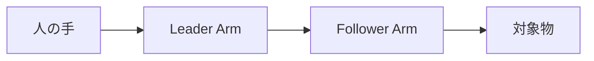
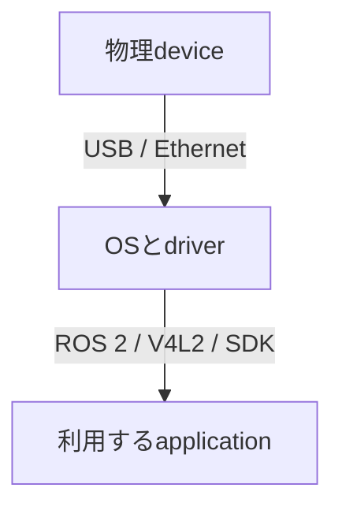
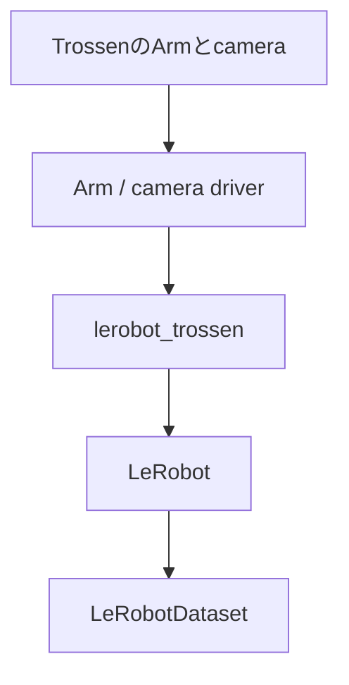

# 00 最初に知ること

この章では、コマンドを実行する前にALOHAの全体像をつかみます。用語を暗記する章ではありません。

読み終えたときに、次の問いへ大まかに答えられれば十分です。

1. 人はどのArmを動かし、実際に物を触るのはどのArmか。
2. 1回の操作から、どのようなdataが保存されるか。
3. hardwareとsoftwareの間に、どのような層があるか。
4. 問題が起きたとき、どこから確認すればよいか。

## 1. ALOHAは「動作の見本を集める装置」

ロボットに作業を学習させるには、まず人が実行した見本を集めます。この見本を**demonstration（デモンストレーション）**と呼びます。

ALOHAでは、人が小さな操作用Armを動かすと、作業用Armが同じように動きます。

この操作方法を**teleoperation（遠隔操作）**と呼びます。「遠隔」といっても、必ずしも離れた場所やインターネット越しという意味ではありません。人が入力する側と、作業する側が分かれているという意味です。

左右2本ずつを使う構成では、次の対応になります。

| 操作するArm | 追従して作業するArm |
|---|---|
| 左Leader | 左Follower |
| 右Leader | 右Follower |

左右やLeader / Followerの対応を間違えると、予想していないArmが動きます。そのため、softwareを入れる前に、物理的なArmとsoftware上の名前を対応付けます。

## 2. 1回の操作で何を記録するのか

camera動画だけを保存しても、ロボットは「どの画像のときに、どの関節をどう動かしたか」を学べません。そこで、画像とロボットの数値dataを同じ時間軸で記録します。

ある時刻$t$ごとに、cameraから見えた画像、Follower Armの現在状態、人が与えた操作指令を組にして記録する。

この3つを少しずつ時刻を進めながら保存すると、1回の作業の記録になります。

### Observation、state、action

- **observation（観測）**: その時点でロボットが利用できる情報全体。camera画像やArmの状態を含みます。
- **state（状態）**: observationのうち、関節角度などロボット自身を表す数値です。
- **action（行動）**: 次にどのように動くかを表す操作指令です。

この教材では、左右Follower Armについて各7個、合計14個のstateとactionを記録します。最初は各値の細かな意味を覚える必要はありません。「現在の姿勢を表す数値」と「次の操作を表す数値」が別に保存されることを理解してください。

### Episode

収録を開始してから終了するまでの1回分を**episode（エピソード）**と呼びます。

例えば、

> blockをつかみ、右側のtrayへ置く

という作業を10回収録した場合、同じtaskについて10 episodesのdemonstrationが得られます。

## 3. 保存されるDataset

収録結果のまとまりを**Dataset（データセット）**と呼びます。この教材ではLeRobotDataset v3という形式を使います。

| Directory | 保存内容 |
|---|---|
| `data/` | state、action、timestampなどの表形式data |
| `videos/` | cameraごとのvideo |
| `meta/` | camera名、data型、episode数などの説明 |

- 数値dataには**Parquet**という表形式のfile formatを使います。
- camera画像はcameraごとのvideoとして保存されます。
- **metadata**には、Datasetの構造やepisodeの区切りが保存されます。

recordingの画面が終了しても、これらが正しく対応しているとは限りません。そのため最後に**validation（検証）**を行います。

## 4. 実機はどのようにPCへつながるか

ALOHAを設定するとき、Armとcameraを同じ種類のdeviceとして扱わないことが重要です。

| PCからの経路 | 接続する機器 | 指定方法 |
|---|---|---|
| Ethernet switch | Arm Controller 4台 | IP address |
| USB | RealSense camera 4台 | serial number |

### Arm

各ArmにはArm Controllerがあり、PCとはEthernet networkで通信します。network上の各Controllerを区別する番号が**IP address**です。

softwareから4台が見えただけでは、どれが左Followerかは分かりません。1台ずつidentify動作を行い、物理的なArmとIP addressを対応付けます。

### Camera

RealSense cameraはUSBでPCにつながります。各個体を区別するために**serial number**を使います。

cameraのserial numberだけを見ても、上方cameraか左手首cameraかは分かりません。実際の画像を表示し、設置位置と対応付けます。

### 接続方法とsoftware interfaceは別の話

USBやEthernetは物理的な接続方法です。ROS 2やV4L2は、softwareがdataを受け取る方法です。

例えば「USB cameraをV4L2で読み、FFmpegで保存する」と表現できます。USB、V4L2、FFmpegは同じ種類の選択肢ではありません。

## 5. softwareは役割ごとに分かれている

ALOHAを動かすsoftwareは一つの巨大なprogramではありません。役割の異なるsoftwareが順につながっています。

- **driver**: OSやprogramからhardwareを操作するためのsoftwareです。
- **`lerobot_trossen`**: TrossenのhardwareをLeRobotから使えるようにするpluginです。
- **LeRobot**: teleoperation、recording、Dataset、model学習を共通の形で扱うframeworkです。
- **LeRobotDataset**: LeRobotが読み書きするdataの保存形式です。

詳しい役割分担は01で、実際の操作は02で扱います。

## 6. 初めて出会う開発用語

### RepositoryとGit

**repository**は、source code、設定file、説明資料をまとめて履歴管理する単位です。**Git**はその変更履歴を扱うtoolです。

この教材本体と、setup時に取得する`lerobot_trossen`は別のrepositoryです。

### Commitとversion

softwareは更新されると、同じcommandでも動作が変わることがあります。Gitでは、ある時点のsource codeを**commit**という識別子で指定できます。

この教材では、実機で確認したcommitへ固定します。最初の動作確認が終わる前に最新版へ変更しないでください。

### Environmentとdependency

Python programは、Python本体だけでなく多くの追加packageを使います。それらを**dependency（依存関係）**と呼びます。

Pythonとdependencyの組合せが**environment（実行環境）**です。この教材では`uv`というtoolで同じ組合せを再現します。

### Configuration

IP address、camera serial、FPSなど、実行時に変えたい値をまとめたものが**configuration（設定）**です。

この教材では主にYAML形式を使います。YAMLではindentationが構造を表すため、空白を不用意に変えないでください。

## 7. 問題をどこから調べるか

初心者が最初に身につけるべきなのは、error messageを暗記することではなく、問題の層を切り分ける方法です。

### Armが動かない例

1. Controllerに電源が入っているか。
2. Ethernet cableとswitchはつながっているか。
3. PCが同じnetworkにいるか。
4. IP addressへ到達できるか。
5. DriverからControllerを発見できるか。
6. Teleoperationだけが失敗しているのか。

### Cameraが映らない例

1. USB cableと電源状態は正常か。
2. OSがcameraを認識しているか。
3. Serial numberは正しいか。
4. 別programがcameraを使用していないか。
5. 指定したresolution / FPSで開始できるか。
6. LeRobotのrecordingだけが失敗しているのか。

下の層が失敗している場合、上のapplication設定を変えても直りません。04では、この順序で具体的に切り分けます。

## 8. この章の理解確認

答えは本文中にあります。言葉が完全に一致しなくても、仕組みを説明できれば十分です。

1. LeaderとFollowerはそれぞれ何をするArmですか。
2. camera動画だけでなくstateとactionも保存するのはなぜですか。
3. 1 episodeとはどこからどこまでですか。
4. ArmとRealSense cameraは、PCへの接続方法と個体の指定方法がどう違いますか。
5. USB cameraとV4L2 cameraという説明は、同じ層の話ですか。
6. cameraがOSから見えていないとき、最初にLeRobotのDataset設定を変更すべきですか。

次は[01 使用するソフトウェア](01_reference_stack.md)へ進みます。
