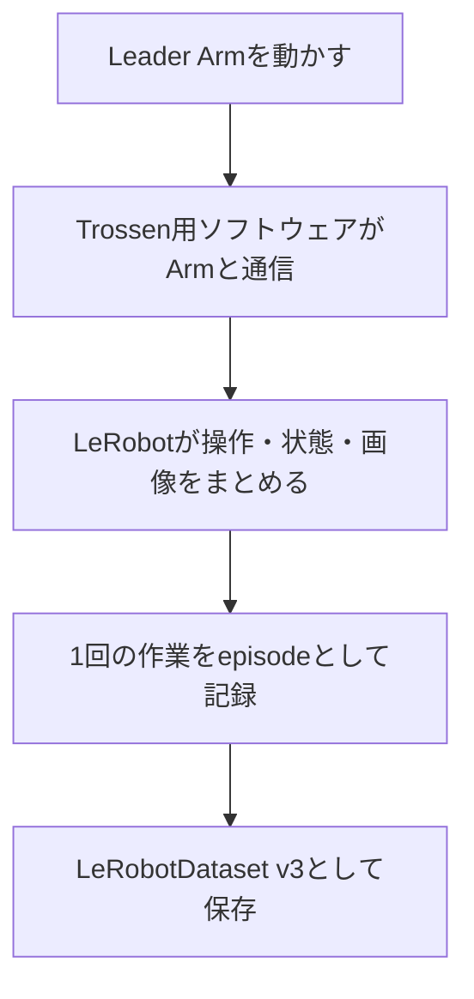
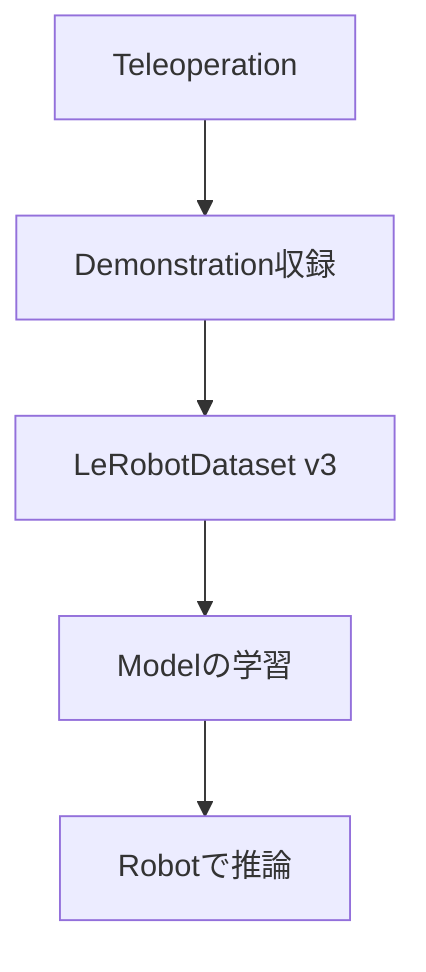

# 01 使用するソフトウェアを理解する

この章では、これから使うソフトウェアがそれぞれ何を担当しているかを説明する。まだコマンドは実行しない。

最初に覚えるべきことは製品名の一覧ではなく、**人の操作がロボットの動きになり、その記録がDatasetになるまでの道筋**である。

## 1. 一つの収録を、五つの役割に分ける

赤いブロックをトレイへ移すデモを記録するとき、内部では次の処理がつながっている。



各部の名前と役割は次のとおりである。

| 名前 | この構成での役割 | たとえるなら |
|---|---|---|
| Trossen Stationary AI | Arm、Controller、cameraなどの実機 | 動かす機械そのもの |
| Trossen Arm library | Controllerと通信してArmを読み書きする | 機械を操作する専用ドライバ |
| `lerobot_trossen` | TrossenのArmをLeRobotから使えるようにする | 専用プラグを共通規格へ変換するアダプタ |
| LeRobot | 操作、状態取得、camera取得、収録をまとめる | 収録全体を進行するシステム |
| LeRobotDataset v3 | state、action、画像、task情報の保存形式 | 学習に渡せる整理済みの実験ノート |

`lerobot_trossen`とLeRobotは同じものではない。前者は**Trossen固有hardwareとの橋渡し**、後者は**robot learning全体の共通framework**である。また、LeRobotDatasetは保存形式であり、Armを動かすsoftwareではない。

## 2. `setup.sh`を実行すると何が準備されるか

[02](02_data_collection.md)では最初に次を実行する。

```bash
./setup.sh
```

この1行は、裏側で主に次を行う。

1. Trossenの連携softwareを取得する
2. この資料で動作確認したsource codeの時点へ合わせる
3. 必要なPython packageをまとめて導入する
4. 実行用のPython environmentを用意する

ここで登場する用語を整理する。

| 用語 | 意味 | なぜ必要か |
|---|---|---|
| Repository | source codeと変更履歴をまとめた保管場所 | 同じcode一式を取得するため |
| Commit | repository内の特定時点を示すID | 「最新版」ではなく、確認済みの同じ内容を使うため |
| Dependency | 実行に必要な別のsoftware package | versionの組み合わせ違いによる不具合を減らすため |
| Python environment | project専用のPythonとpackageの組 | 他projectのpackageと混ざらないようにするため |
| `uv` | Python environmentとdependencyを管理するtool | 同じ依存関係を再現しやすくするため |

## 3. この資料で使う確認済みの組み合わせ

複数のsoftwareは、個別に新しければよいわけではない。互いのAPIやデータ形式が対応している必要があるため、この資料では実機で最後まで確認した組み合わせを出発点にする。

| 項目 | 使用する版 |
|---|---|
| Trossen integration | `TrossenRobotics/lerobot_trossen` |
| Verified commit | `a4336933f34192a3daa7e9fb52674284bb5ae48e` |
| LeRobot | 0.6.0 |
| Python | 3.12 |
| Trossen Arm library | 1.10.0 |
| Dataset | LeRobotDataset v3.0 |

この組み合わせを**baseline**と呼ぶ。baselineとは、変更や比較を始める前に「ここまでは動く」と確認した基準構成である。最初の収録が終わるまではversionを変更しない。

更新が必要になった場合は、[05 保守と更新](05_maintenance.md)に従って、hardware check、teleoperation、recording、validationを再実行する。

## 4. 実機の名前を設定ファイルで教える

softwareは、机の左側にあるArmや上側のcameraを目で判断できない。そこで利用者が、物理的な役割と機器固有の識別子を対応付ける。

| 実機 | softwareが使う識別子 | 役割の例 |
|---|---|---|
| Arm Controller | IP address | `leader_left`、`follower_right` |
| RealSense camera | serial number | `cam_high`、`cam_left_wrist` |

対応関係は次のlocal fileに記入する。

```text
config/hardware-local.yaml
```

`YAML`は、人が読み書きしやすい設定ファイル形式である。このfileには4台のArmのIP addressと4台のcameraのserial numberだけを集約する。収録条件など別の設定と分けることで、Armやcameraを交換したときに直す場所が分かりやすくなる。

実際の識別方法は[02のStep 2とStep 3](02_data_collection.md)で、実機を見ながら行う。

## 5. 保存されたDatasetは、次の学習工程への入口になる

この資料が扱う主な範囲は、teleoperationでデモを作り、LeRobotDataset v3として検証するところまでである。



ACT、SmolVLA、π系などは、Datasetから動作を学習する**model**の候補である。modelをどのrepositoryやCLIで学習・推論するかは別の選択である。本資料では、まずどのmodelを選ぶ場合にも必要になる「信頼できるデモを作る」工程に集中する。

## 6. 別の構成を調べるときの見方

最初の収録に成功した後で別のsoftwareを比較するときは、名前を横並びにせず、何を置き換える候補かを確認する。

| 調べる層 | 問いの例 |
|---|---|
| 駆動・teleoperation・記録 | どのArmに対応し、複数cameraとstate/actionを記録できるか |
| Dataset形式 | 画像・state・action・metadataをどう保存するか |
| Model | どのobservationから、どのactionを予測するか |
| 学習・推論の実行系 | どのrepository・command・計算環境でmodelを動かすか |

ROS 2もこの整理の中で考える。ROS 2はrobotやsensorのprocess間でdataを交換する仕組みであり、Dataset形式やmodel名ではない。追加sensorがROS 2でdataを出す場合は、その出力を使って収録へ接続できる。詳しくは[03 外部センサを追加する](03_architecture_and_extension.md)で扱う。

## 7. 次へ進む前の確認

次の三つを自分の言葉で説明できれば十分である。

1. `lerobot_trossen`とLeRobotは、それぞれ何を担当するか。
2. ArmはIP address、cameraはserial numberで指定するのはなぜか。
3. baselineのversionを固定してから作業を始めるのはなぜか。

分からない用語があれば[00 最初に知ること](00_concepts_and_terminology.md)へ戻る。説明できたら、[02 最初のデータを収録する](02_data_collection.md)へ進む。

## 8. 公式資料

- [Trossen Robotics LeRobot integration](https://github.com/TrossenRobotics/lerobot_trossen)
- [Trossen Robotics LeRobot Installation Guide](https://docs.trossenrobotics.com/trossen_arm/main/tutorials/lerobot_plugin/setup.html)
- [Hugging Face LeRobot documentation](https://huggingface.co/docs/lerobot/)
