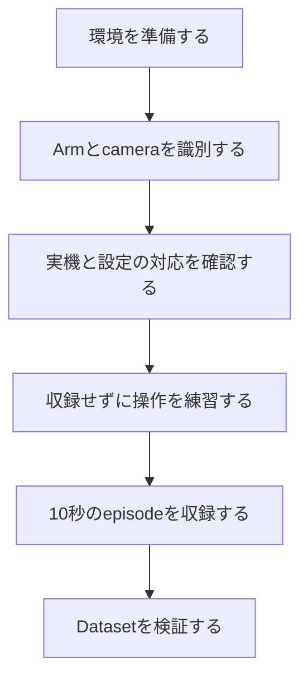
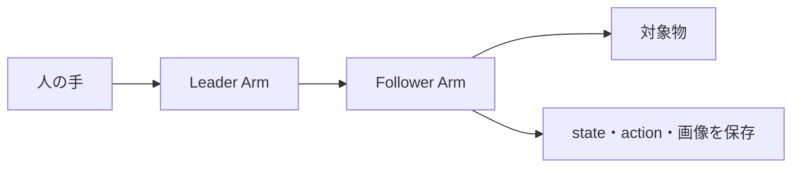

# 02 最初のデータを収録する

この章では、組み立て済みのALOHAを初めてPCから使い、10秒のdemonstrationを1 episode収録する。

題材は次のような単純な作業でよい。

> Leader Armを手で動かし、Follower Armでブロックを持ち上げ、隣のトレイへ置く。

作業が成功したら、4台のcamera画像、左右Follower Armの状態、人が与えた操作指令が同じ時間軸で保存される。最後にvalidatorで、保存構造が壊れていないことを確認する。

## 1. これから行う作業



各Stepには、次へ進んでよい状態を「完了条件」として示す。errorが出たまま後段へ進むと原因が増えるため、完了条件を一つずつ通過する。

### 入力例の読み方

`<ARM_IP>`のように山括弧で囲まれた部分は、その文字を入力するのではなく、自分で確認した値へ置き換える。

例えば、説明が次の場合、

```bash
uv run trossen-arm identify --ip <ARM_IP>
```

確認したIP addressが`192.168.1.5`なら、実際には次のように入力する。山括弧は残さない。

```bash
uv run trossen-arm identify --ip 192.168.1.5
```

本章の「記入例」にあるIP addressやserial numberは形式を示す説明用の値である。自分の環境へそのままコピーせず、Step 2と3で確認した値を使用する。

### Teleoperationとは

**Teleoperation（遠隔操作）**は、人がLeader Armを動かし、その動きをFollower Armへ伝える操作方式である。ここでの「遠隔」は、必ずしもインターネット越しという意味ではない。入力側のLeaderと、物体を扱うFollowerが分かれていることを表す。

収録中の流れは次のようになる。



### 作業前の安全確認

- Follower Armの周囲から、人、工具、配線、壊れやすい物を退避する。
- Armを大きく動かす前に、停止方法が`Ctrl+C`であることを確認する。
- 起動直後はFollowerが追従し始めるまでLeaderを現在位置付近で保持する。
- error後にControllerの電源を切る場合は、保持力を失うArmを手で支持する。
- 不明な挙動を繰り返して確認せず、停止して[04 Troubleshooting](04_troubleshooting.md)で切り分ける。

## Step 0: PCと実機の接続を理解する

### 目的

Armとcameraを、softwareがどの識別子で見つけるのかを理解する。

| 機器 | PCまでの接続 | softwareで指定するもの |
|---|---|---|
| Arm Controller 4台 | Ethernet switch経由 | IP address |
| RealSense D405 4台 | USB | serial number |

ArmにIP addressがあるのは、ControllerがEthernet network上の機器だからである。USB接続のRealSenseはIP addressではなく、製品ごとに割り当てられたserial numberで区別する。

`leader_left`や`cam_high`はsoftware上の役割名であり、機器自身が知っている名前ではない。後のStepで、利用者が「このIPは左Leader」「このserialは上方camera」と対応付ける。

### 完了条件

- ArmはEthernet/IP、RealSenseはUSB/serialで識別する、と説明できる。
- PC、Ethernet switch、4台のController、4台のcameraが物理的に接続されている。

## Step 1: Software environmentを準備する

### 目的

この資料で検証したsource codeとPython packageをPCへ準備する。

### 実行

Ubuntu 24.04上で、まず`git`と`uv`を確認する。

```bash
git --version
uv --version
```

`uv`がない場合は[uv公式installation](https://docs.astral.sh/uv/getting-started/installation/)に従って導入する。

GitHubから取得する場合は次を実行する。

```bash
git clone https://github.com/26Taku/aloha-vla-reference.git
cd aloha-vla-reference
./setup.sh
```

ZIPで受け取った場合は展開し、`README.md`と`setup.sh`があるdirectoryへ移動して`./setup.sh`を実行する。

### 何が起きるか

`setup.sh`はTrossen連携softwareを取得し、確認済みcommitへ合わせ、`uv`でproject専用のPython environmentを作る。詳しい役割は[01 使用するソフトウェア](01_reference_stack.md)で説明している。

### 完了条件

- `setup.sh`がerrorなく終了した。
- Python 3.12、LeRobot 0.6.0、Trossen Arm 1.10.0が表示された。
- `lerobot_trossen`のcommitが`a4336933f34192a3daa7e9fb52674284bb5ae48e`である。

ここで失敗した場合は[04のsetup・dependency](04_troubleshooting.md)を確認する。

## Step 2: 4台のArmを見分ける

### 目的

検出されたIP addressが、左右どちらのLeader / Followerに対応するかを確定する。

### 実行

まずPCのnetwork addressを確認する。

```bash
ip -br addr
```

標準構成では、Armと通信するinterfaceに`192.168.1.x/24`のaddressが必要である。次にControllerを検出する。

例えば、次のような行が表示された場合、`eno1`というnetwork interfaceに`192.168.1.1/24`が設定されている。

```text
eno1    UP    192.168.1.1/24
```

```bash
(
  cd lerobot_trossen
  uv run trossen-arm discover
)
```

候補のIPごとに次を実行する。

```bash
(
  cd lerobot_trossen
  uv run trossen-arm identify --ip <ARM_IP>
)
```

`<ARM_IP>`は、`discover`で表示された実際の値へ置き換える。`identify`ではgripperが動くため、指や工具を近づけない。動いたArmを見て、次の表を自分の値で埋める。

| 物理的な役割 | 確認したIP address |
|---|---|
| 左Leader |  |
| 右Leader |  |
| 左Follower |  |
| 右Follower |  |

標準kitでは`.3`、`.2`、`.5`、`.4`がそれぞれ左Leader、右Leader、左Follower、右Followerであることが多い。ただし、**参考値をそのまま設定せず、実際に動いたArmで判断する**。

#### 記入例

4台をidentifyした結果が標準的な配置だった場合、記録表は次のようになる。

| 物理的な役割 | 確認したIP address |
|---|---|
| 左Leader | `192.168.1.3` |
| 右Leader | `192.168.1.2` |
| 左Follower | `192.168.1.5` |
| 右Follower | `192.168.1.4` |

例えば`192.168.1.5`をidentifyしたときに左側の作業用Armが動いたため、「左Follower = `192.168.1.5`」と判断する。IPの末尾だけを見て推測するのではなく、このように実機の動作を根拠にする。

### 完了条件

- `discover`で4台のControllerが見える。
- 4個のIP addressと物理Armの対応を確認した。
- Controllerの`Error State`に未解決の異常がない。

## Step 3: 4台のcameraを見分ける

### 目的

検出されたserial numberを、上方・低位置・左右手首のcameraへ対応付ける。

### 実行

```bash
(
  cd lerobot_trossen
  uv run lerobot-find-cameras realsense
)
```

cameraごとの画像が次へ保存される。

```text
lerobot_trossen/outputs/captured_images/
```

保存画像を開き、画角からcameraの設置位置を判断する。分かりにくければ1台のlensだけをカードで覆って再実行する。

| cameraの役割 | 確認したserial number |
|---|---|
| 上方 `cam_high` |  |
| 低位置 `cam_low` |  |
| 左手首 `cam_left_wrist` |  |
| 右手首 `cam_right_wrist` |  |

#### 記入例

以下はserial numberの形式と記録方法を示す架空の例である。

| cameraの役割 | 確認したserial number | 判断した画像 |
|---|---|---|
| 上方 `cam_high` | `100000000001` | 作業台全体を上から撮影 |
| 低位置 `cam_low` | `100000000002` | 作業台を正面の低い位置から撮影 |
| 左手首 `cam_left_wrist` | `100000000003` | 左Followerのgripperが近くに映る |
| 右手首 `cam_right_wrist` | `100000000004` | 右Followerのgripperが近くに映る |

実際のserial numberは、この例とは異なる。数字だけでなく保存画像も確認して役割を決める。

### 完了条件

- 4台のRealSenseが検出される。
- 4個のserial numberとcameraの設置位置を画像で確認した。

## Step 4: 対応関係を設定ファイルへ記入する

### 目的

Step 2と3で調べた8個の値を、以降のcommandが共通して使えるようにする。

### 実行

repository rootへ戻り、templateを複製する。

```bash
cp config/hardware-template.yaml config/hardware-local.yaml
nano config/hardware-local.yaml
```

4台のArmのIP addressと4台のcameraのserial numberを対応する欄へ記入する。保存後、未入力のplaceholderがないことを確認する。

#### 記入済みYAMLの例

Step 2と3の記入例を使うと、fileは次の形になる。

```yaml
arms:
  follower_left_ip: 192.168.1.5
  follower_right_ip: 192.168.1.4
  leader_left_ip: 192.168.1.3
  leader_right_ip: 192.168.1.2

cameras:
  cam_high: "100000000001"
  cam_low: "100000000002"
  cam_left_wrist: "100000000003"
  cam_right_wrist: "100000000004"
```

左側の名前はsoftwareが期待するfield名なので変更しない。右側の値だけを、自分が確認したIP addressとserial numberへ置き換える。Camera serialは数値に見えても識別子なので、例では引用符で囲んで文字列として記入している。

```bash
grep -n 'REPLACE_WITH_' config/hardware-local.yaml
```

何も表示されなければよい。さらに、この個体固有fileがGitへ登録されない設定になっていることを確認する。

```bash
git check-ignore -v config/hardware-local.yaml
```

### 何が起きるか

このfileは「software上の役割名」と「実機の識別子」の対応表である。収録scriptは毎回この対応表を読み、正しいArmとcameraを開く。

### 完了条件

- 8個の値を記入した。
- `grep`が無出力である。
- `git check-ignore`が`hardware-local.yaml`を表示する。

## Step 5: 動かす前に一括確認する

### 目的

設定、network、camera、保存先をまとめて検査し、安全にteleoperationへ進めるか判断する。

### 実行

```bash
./check_hardware.sh
```

このscriptは主に、4台のArmへの到達、設定した4台のRealSense、data directoryへの書き込み、空き容量を確認する。

### 完了条件

最後に次が表示される。

```text
[READY]
```

`[READY]`でなければteleoperationへ進まない。自分の出力を[06のhardware preflight](06_validation_results.md)と比較し、[04 Troubleshooting](04_troubleshooting.md)で該当する層を確認する。

## Step 6: 収録せずに操作を練習する

### 目的

左右の対応、gripper、camera画角、Followerの動きを確認する。最初から収録すると、機器の取り違えと操作の失敗を区別しにくいため、先に練習する。

### 実行

```bash
./teleoperate.sh
```

起動直後はLeaderを現在位置付近で保持する。Followerが小さな動きへ連続して追従することを確認してから、可動範囲の中央付近でゆっくり動かす。

次を順番に確認する。

- 左Leaderを動かすと左Followerが動く。
- 右Leaderを動かすと右Followerが動く。
- 左右のgripperが対応して開閉する。
- 4画面が、上方・低位置・左右手首の正しい画角である。
- 不自然な振動、急な移動、連続errorがない。

終了は`Ctrl+C`で行う。

### なぜ起動直後に待つのか

実機検証では、Leaderが操作可能になってからFollowerの追従loopが始まるまで短い時間差が生じる場合があった。その間にLeaderを大きく移動すると、Followerが姿勢差を急に埋めようとしてjoint velocity limitで停止することがある。

### 完了条件

- 左右の対応と4画面が正しい。
- 小さな操作にFollowerが滑らかに追従する。
- `Ctrl+C`後に正常に終了する。

検証環境ではcontrol loopが概ね30 Hzだった。挙動の比較は[06のteleoperation](06_validation_results.md)を参照する。

## Step 7: 10秒のdemonstrationを収録する

### 目的

1回の作業を、学習に使える1 episodeとして保存する。

### 実行

作業空間へブロックとトレイを置き、次を実行する。

```bash
./record.sh first_demo "Move the block to the tray" 1 10
```

引数の意味は次のとおりである。

| 値 | 意味 |
|---|---|
| `first_demo` | 保存するDataset名 |
| `"Move the block to the tray"` | 作業内容を表すtask description |
| `1` | episode数 |
| `10` | 1 episodeの秒数 |

収録中は、練習時と同じ安全確認を行い、急がず一つの作業を完了する。同名Datasetが既にある場合は上書きせず停止する。

### 何が保存されるか

| 内容 | 標準構成 |
|---|---|
| 左右のaction | 合計14次元 |
| 左右Followerのstate | 合計14次元 |
| RGB video | 4 streams、424×240、target 30 fps |
| task・episode・時刻情報 | metadataとframe情報 |
| 保存先 | `data/first_demo/` |

**14次元**は、左右Armそれぞれの7値を合わせた数である。Parquetには主に数値data、video fileにはcamera画像、metadataにはDataset全体の説明が保存される。

### 完了条件

- processが異常終了していない。
- `data/first_demo/`が作成された。
- 数値data、4本のvideo、metadataが保存された。

## Step 8: Datasetを機械的に検証する

### 目的

frame、timestamp、数値data、video、metadataの対応が壊れていないことを検査する。

### 実行

```bash
./validate_dataset.sh data/first_demo
```

validatorは、Dataset version、frame数、timestampの増加、action/stateの次元、4本のvideo、解像度、先頭frameのdecodeなどを確認する。

### 完了条件

最後に次が表示される。

```text
[PASS]
```

検証環境の10秒収録では299 framesだった。開始・終了の境界やPC負荷で多少変動するため、299への完全一致を要求しない。極端に少ない場合やvideo rateが大きく異なる場合は、[06の基準値](06_validation_results.md)と比較して原因を調べる。

## Step 9: 内容を人の目で確認する

`[PASS]`は、file構造が整っていることを示す。次の内容までは保証しない。

- blockを実際に持ち上げられたか。
- 手やArmで対象物が隠れていないか。
- task descriptionと実演内容が一致するか。
- 途中に危険な急動作や不要な停止がないか。

4視点のvideoを再生し、作業の開始から終了までを確認する。機械検査と目視検査の両方を通ったepisodeを、学習用データの候補とする。

## 10. ここまでで身についたこと

ここまで完了した利用者は、次を一連の因果関係として説明できる。

1. PCがIP addressでArm Controllerを、serial numberでcameraを識別する。
2. local configが物理機器とsoftware上の役割を結び付ける。
3. Teleoperationで人の操作をFollowerへ伝える。
4. state、action、videoを1 episodeとして保存する。
5. validatorと目視でDatasetを確認する。

次は、目的に応じて以下へ進む。

- 外部sensorを追加する: [03 外部センサを追加する](03_architecture_and_extension.md)
- errorを調べる: [04 Troubleshooting](04_troubleshooting.md)
- versionやhardwareを変更する: [05 保守と更新](05_maintenance.md)
- 自分の数値を実測例と比較する: [06 実機検証結果と正常性の判断](06_validation_results.md)
- 外部sensor用scriptの引数を確認する: [Custom Sensor Script Reference](../examples/custom_sensor/README.md)

## 11. 公式資料

- [Trossen Arm: Software Setup / Arm Network Setup](https://docs.trossenrobotics.com/trossen_arm/main/getting_started/software_setup.html)
- [Trossen Arm: Command Line Interface](https://docs.trossenrobotics.com/trossen_arm/main/getting_started/cli.html)
- [Trossen AI Configuration](https://docs.trossenrobotics.com/trossen_arm/main/tutorials/lerobot/configuration.html)
- [Hugging Face LeRobot documentation](https://huggingface.co/docs/lerobot/)
