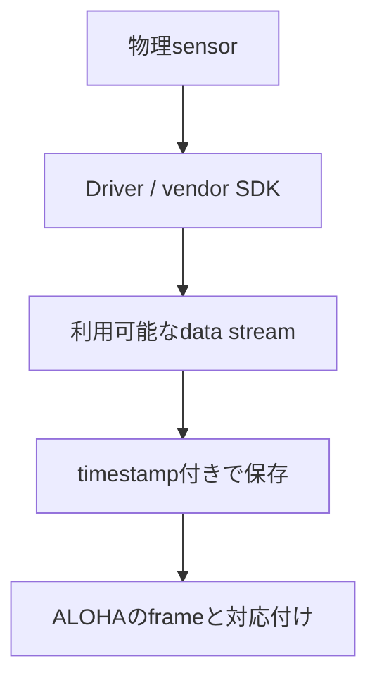
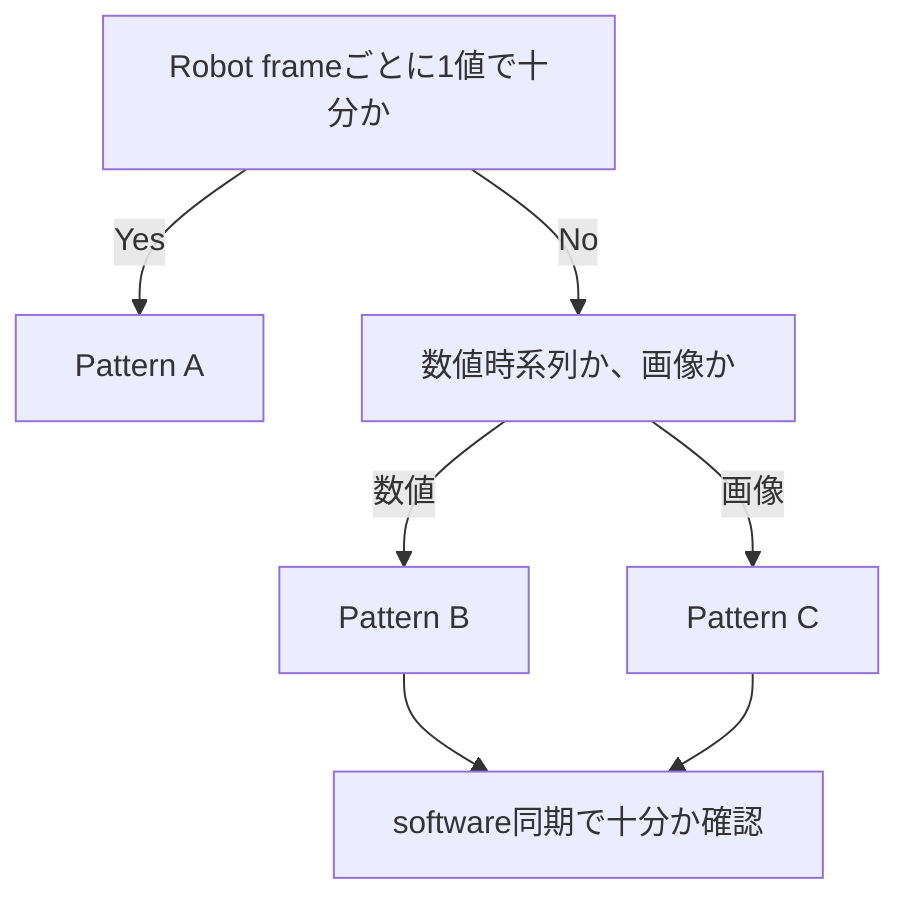
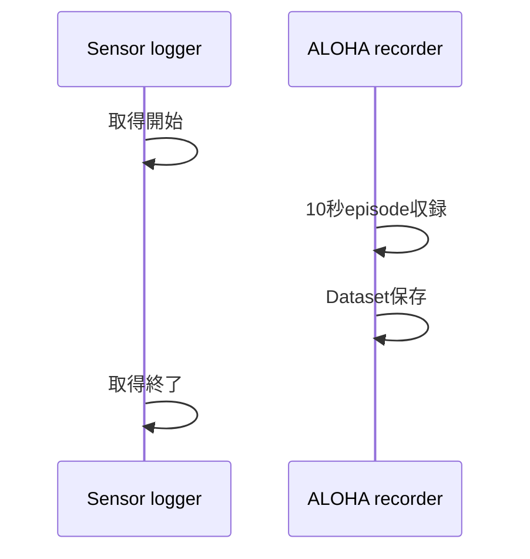

# 03 外部センサを追加する

この章では、ALOHAへ新しいsensorを追加するときの考え方を学ぶ。対象sensorの専用manualを覚えることが目的ではない。初めて見るsensorでも、**どこまで動いていて、どこからALOHA収録へ接続すればよいか**を自分で調べられる状態を目指す。

[02](02_data_collection.md)のbaseline収録が`[PASS]`になってから進む。baselineが動かない状態でsensorも同時に追加すると、問題がALOHA側かsensor側か分からなくなる。

## 1. 具体例から考える: 力覚センサを追加したい

Followerの手先に力覚sensorを取り付け、物体をつかんだときの力を記録したいとする。

まず確認するのは「USBでつながるか」だけではない。次の順で見る。

| 確認すること | この例での答え |
|---|---|
| 物理的に何でつながるか | sensor固有のcable、USB、Ethernetなど |
| OS・driverから読めるか | vendor toolや既存driverで値が変化する |
| 他softwareへどう渡されるか | 例: ROS 2 topic |
| 1秒間に何sample出るか | 例: 約100 Hz |
| 何を残したいか | 6軸のforce / torqueの時系列 |
| ALOHAとどの精度で時刻を合わせるか | 同一PCのsoftware timestampで十分か |

### 調査票を埋めた例

新しいsensorを渡されたら、最初に次のような1枚の調査票を作る。以下は「MMS101由来の力覚dataがROS 2へ出ている」と仮定した記入例である。

| 項目 | 記入例 | 値の調べ方 |
|---|---|---|
| Sensor | MMS101 force/torque sensor | 本体表示・製品資料 |
| 物理接続 | USB serial adapter経由 | cableと`lsusb`等を確認 |
| 利用するinterface | ROS 2 topic | `ros2 topic list` |
| Topic | `/force_torque/left` | `ros2 topic list` |
| Message type | `geometry_msgs/msg/WrenchStamped` | `ros2 topic type` |
| Data | force 3軸 + torque 3軸 | `ros2 topic echo --once` |
| Actual rate | 約100 Hz | `ros2 topic hz` |
| 残したい情報 | 100 Hzの全sample | 実験目的から決める |
| Timestamp | 同一PCの受信monotonic時刻 | Driverとloggerの仕様を確認 |
| 選択するPattern | B: Numeric sidecar | Section 3の表で判断 |

値が不明な欄を推測で埋めない。「どのcommand・資料で確認するか」を右列に書き、確認後に値を記入する。

USBやEthernetは**物理的な通信経路**である。ROS 2やvendor SDKは、programがdataを受け取るための**software interface**である。これらを同じ分類として扱わない。



sensorごとに異なるのは主にCまでである。Cより後の「保存・時刻・対応付け・検証」は、多くのsensorで共通して考えられる。

## 2. 最初に判断する四つのこと

### 2.1 Robotの1 frameごとに1値あればよいか

ALOHAのbaselineはおよそ30 frames/sで記録する。温度のようにゆっくり変わる値なら、robot frameごとに1値を持てば十分な場合がある。その場合はLeRobotのobservationへ直接追加する方法を検討できる。

一方、100 Hzの力覚波形を先に30 Hzへ間引くと、接触直後の短い変化を失う可能性がある。この場合は、sensor本来のrateで別fileへ保存する。

### 2.2 生のsampleや全camera frameを残す必要があるか

学習用の入力が30 Hzでも、収録時点ではraw dataを残しておくと、後からfilter、window幅、resampling方法を変えられる。取得時に捨てたsampleは復元できない。

### 2.3 すでに使えるdriverやinterfaceがあるか

既存の研究code、vendor SDK、ROS 2 driver、Linux camera interfaceが安定して動いているなら、それを再利用する。ALOHAへ合わせるためにsensor driver全体を書き直す必要はない。

### 2.4 必要な同期精度はどの程度か

同じPCで取得し、数msから数十ms程度のずれを評価できればよいtaskでは、PCのmonotonic clockによるsoftware timestampが出発点になる。sub-millisecondの同期、複数cameraの同時露光、複数PC間の厳密な同期が必要なら、hardware triggerや共有clockを別途設計する。

## 3. 保存方法を選ぶ

| Pattern | 適するdata | 保存方法 | 例 |
|---|---|---|---|
| A: Direct observation | robot frameごとに1値・1 frameで十分 | LeRobotDatasetへ直接追加 | 低rateの状態量 |
| B: Numeric sidecar | 高rateの数値時系列を残したい | timestamp付きの別file | 力覚、IMU |
| C: Camera sidecar | robotと異なるFPSで全frameを残したい | native videoとtimestamp | tactile camera |
| D: Hardware sync | software timestampでは精度不足 | trigger・共有clockを設計 | 同時露光、sub-ms計測 |

**Sidecar**は、main Datasetと同時に保存する補助fileである。別fileでも、共通の時刻基準があれば後からrobot frameと対応付けられる。

判断の目安は次のとおりである。



software同期が要件を満たさなければPattern Dへ進む。ROS 2だからPattern B、USB cameraだからPattern Cと機械的に決めるのではなく、**残したい情報と時間分解能**で決める。

### 選択例

| Sensorの状況 | 判断 | 選択 |
|---|---|---|
| 力覚sensorが約100 Hzで出力し、接触直後の波形を残したい | 30 Hzへ先に間引くと情報を失う | Pattern B |
| Tactile cameraが約18.8 Hzで動き、全画像を残したい | Robotの30 HzとFPSが異なる | Pattern C |
| 室温が1 Hzで変化し、robot frameごとに直近値があればよい | Native historyを残す必要が小さい | Pattern Aの候補 |
| 二つのcameraを同一露光時刻で比較したい | Software timestampだけでは保証できない | Pattern Dを検討 |

## 4. 新しいsensorを追加する標準手順

### Step 1: Sensor単体で動かす

ALOHAを起動せず、sensorだけからsampleまたはframeを継続取得する。

確認するもの:

- OSがdeviceを認識している。
- driverまたはvendor sampleが起動する。
- sensorを触る、動かす、荷重を与えると値や画像が変化する。
- data形式と実際のrateを確認できる。

ここで動かなければ、まだALOHA integrationの問題ではない。電源、cable、firmware、権限、driver、device identifierの順に調べる。

### Step 2: ALOHAへ渡す境界を一文で書く

次のtemplateを埋める。

> `<interface>`から、`<data形式>`を、実測`<rate>`で取得できる。各sample / frameには`<source時刻の有無>`がある。

例:

> ROS 2 topic `/force_torque/left`から、`geometry_msgs/msg/WrenchStamped`の6軸数値を約100 Hzで取得できる。受信時に同一PCのmonotonic timestampを付ける。

この一文が書ければ、sensor固有の問題と共通収録側の境界が明確になる。

### Step 3: Patternを選ぶ

力覚sensorの100 Hz波形を残すならPattern B、tactile cameraのnative videoを残すならPattern Cが候補になる。選択理由を「接続方式」ではなく「必要なdataとrate」で記録する。

### Step 4: Sensorだけをreference側で記録する

付属toolには二つのreference pathがある。

| 入力 | Reference | 出力 |
|---|---|---|
| ROS 2 numeric topic | `ros2_timeseries_logger.py` | timestamp付きJSONL |
| Linux V4L2 camera | FFmpeg capture | native videoとtimestamp |

具体的なcommandと引数は[Custom Sensor Script Reference](../examples/custom_sensor/README.md)に、V4L2 cameraの詳細は[Asynchronous Camera Reference](../examples/custom_sensor/camera/README.md)にまとめている。

例えば、上の力覚sensor調査票を使い、10秒だけ保存するcommandは次のようになる。

```bash
mkdir -p data/sensor_logs

python3 examples/custom_sensor/ros2_timeseries_logger.py \
  --topic /force_torque/left \
  --msg-type geometry_msgs/msg/WrenchStamped \
  --sensor-id left_force_torque \
  --output data/sensor_logs/left_force_torque.jsonl \
  --duration 10
```

この例では、`<TOPIC>`のような未入力部分は残っていない。別sensorでは、topic、message type、sensor ID、出力file名を自分の調査票に合わせて変更する。

この段階ではALOHAと同時に動かさず、次を測る。

- 指定時間に何sample / frame保存されたか。
- timestampが単調に増加しているか。
- 先頭と末尾のdataを読めるか。
- videoなら先頭frameをdecodeできるか。

### Step 5: ALOHAと同時に記録する

sensor loggerを先に開始し、その取得時間内でALOHAの短いepisodeを収録する。



sensorとALOHAを同時に動かすことで、USB帯域、CPU、storage負荷、process間の干渉を確認できる。ALOHA側も必ず`validate_dataset.sh`で`[PASS]`を確認する。

### Step 6: 時刻で対応付ける

各robot frameの時刻に対し、**同時刻以前で最も新しいsensor sample / camera frame**を選ぶ。これをcausal latest-sample alignmentと呼ぶ。

例えばrobot frameが10.050秒なら、10.047秒のsensor sampleは使えるが、10.053秒のsampleは未来なので使わない。

| Data | 時刻 | このrobot frameに使えるか |
|---|---:|---|
| Sensor sample A | 10.041 s | 使えるが、Bより古い |
| Sensor sample B | 10.047 s | **選択する** |
| Robot frame | 10.050 s | 対応付けの基準 |
| Sensor sample C | 10.053 s | 未来なので使わない |

```text
sensor age = robot frame time - selected sensor time
```

ageが小さいほど、robot frameに近いdataを割り当てている。常に0である必要はなく、sensor rateと処理遅延に応じた分布になる。

例えば、Dataset名を`sensor_reference`、sensor fileを`left_force_torque.jsonl`とした場合、付属toolへの入力例は次のようになる。

```bash
python3 examples/custom_sensor/align_timeseries.py \
  --robot-frames data/sensor_reference/meta/frame_timestamps/episode_000000.jsonl \
  --sensor data/sensor_logs/left_force_torque.jsonl \
  --output data/sensor_logs/left_force_torque_alignment.jsonl
```

ここでも、入力fileが実際に存在することを`ls`等で確認してから実行する。Dataset名やfile名が異なる場合は、その部分だけを置き換える。

### Step 7: 数値で完了を判断する

最低限、次を確認する。

| 項目 | 成功の考え方 |
|---|---|
| standalone acquisition | 一定時間、欠落や停止なく保存できる |
| actual rate | advertised rateではなく実測値を記録した |
| concurrent acquisition | sensorとALOHAを同時に保存できる |
| ALOHA validator | `[PASS]`になる |
| timestamp | 単調増加する |
| aligned frames | 必要なrobot frameへdataが割り当てられる |
| future sample / frame | 0である |
| missing | 件数と理由を把握している |
| age | median、p95、maxを確認した |

[06 実機検証結果と正常性の判断](06_validation_results.md)には、約100 Hzの力覚streamと約18.7 Hzの非同期cameraを実際に接続した結果がある。自分のrateやageが妥当かを考える比較例として使う。

## 5. ROS 2 sensorを調べる

ROS 2では、processが名前付きの**topic**へmessageをpublishし、別processがsubscribeして受け取る。まず次の四つを確認する。

```bash
ros2 topic list
ros2 topic type <SENSOR_TOPIC>
ros2 topic echo <SENSOR_TOPIC> --once
ros2 topic hz <SENSOR_TOPIC>
```

例えば、調べたいtopicが`/force_torque/left`なら、実際の入力は次のようになる。

```bash
ros2 topic type /force_torque/left
ros2 topic echo /force_torque/left --once
ros2 topic hz /force_torque/left
```

`ros2 topic type`の結果が`geometry_msgs/msg/WrenchStamped`なら、その文字列をloggerの`--msg-type`へ入力する。Topic名とmessage typeを取り違えない。

| command | 分かること |
|---|---|
| `list` | 目的のtopicが存在するか |
| `type` | messageの型は何か |
| `echo --once` | 実際のfieldと値は何か |
| `hz` | 実測publish rateはどの程度か |

topicが存在しない場合はloggerを直す前に、sensor driverが起動しているかを確認する。topicは見えるが値が来ない場合は、driverの状態、ROS domain、QoS設定などを調べる。

## 6. V4L2 cameraを調べる

V4L2は、Linuxからcameraを扱う標準interfaceである。まずdeviceと対応modeを確認する。

```bash
v4l2-ctl --list-devices
v4l2-ctl --device <VIDEO_DEVICE> --list-formats-ext
```

例えば一覧にGelSight Miniのcandidateとして`/dev/video6`が表示されたなら、実際の入力は次のようになる。

```bash
v4l2-ctl --device /dev/video6 --list-formats-ext
```

表示からMJPEG、3280×2464、25 fpsを選んだ場合、調査票は次のように記入できる。

| 項目 | 記入例 |
|---|---|
| Device | `/dev/video6` |
| Pixel format | `MJPG` |
| Resolution | `3280x2464` |
| Advertised FPS | 25 |
| 10秒試験のframes | 188 |
| Actual rate | 約18.8 Hz |
| 保存方針 | Native video + timestamp、Pattern C |

`/dev/video6`は説明例であり、USBの認識順によって変わる。自分のPCで`--list-devices`を実行して確認する。Advertised FPSとactual rateは別々に記録する。

ここで確認するのは、device path、pixel format、resolution、advertised FPSである。`/dev/video6`のような番号はUSBの認識順で変わることがあるため、別PCの番号をそのまま使わない。

cameraが25 fpsをadvertiseしていても、実際の保存rateが同じとは限らない。resolution、USB帯域、codec、storage負荷を含め、短いcaptureでactual rateを測る。

## 7. 初めて見るsensorを自分で調べる順序

製品名だけで検索を始めると、接続、driver、ROS wrapper、学習例が混ざりやすい。次の順で問いを限定する。

1. **Manufacturer documentation**: 電源、cable、対応OS、SDK、sample programは何か。
2. **OS recognition**: USB / Ethernet / serial deviceとしてPCから見えるか。
3. **Standalone driver**: ALOHAなしで値や画像を読めるか。
4. **Output interface**: ROS 2 topic、V4L2、Python APIなど、どこからdataを受け取れるか。
5. **Data contract**: 型、単位、axis、resolution、実測rate、timestampは何か。
6. **Storage pattern**: A〜Dのどれで残すか。
7. **Short concurrent test**: baseline ALOHAと同時に短時間だけ動かす。
8. **Validation**: rate、missing、future、ageを測る。

検索語も問いに合わせる。例えば`<製品名> Linux SDK`、`<製品名> ROS 2 message type`、`<製品名> V4L2 format`のように、知りたい層を付ける。

## 8. よくある判断違い

| 判断違い | 何が問題か | 考え直す問い |
|---|---|---|
| すべてのsensorをROS 2へ変換する | 不要な変換と保守箇所が増える | 既存interfaceをそのまま使えないか |
| 高rate dataを最初から30 Hzへ間引く | 後からraw波形を復元できない | native-rateをsidecarへ残す必要はないか |
| cameraのadvertised FPSを実測値とみなす | 実際の保存rateと異なることがある | 10秒captureで何frame保存されたか |
| DatasetがPASSならsensor統合も完了とする | 時刻ずれやfuture data利用を見逃す | alignment指標を測ったか |
| device番号やtopic名を別環境へコピーする | 機器列挙や設定で変わる | 現在のPCで再発見したか |

## 9. この章の完了条件

新しいsensorについて、次を説明・確認できればintegrationの基本工程は完了である。

- 物理接続とsoftware interfaceを分けて説明できる。
- Sensor単体でdataを継続取得できる。
- data形式、単位、実測rate、timestampの扱いを記録した。
- Pattern A〜Dの選択理由を説明できる。
- ALOHAと同時収録し、baseline Datasetも`[PASS]`になった。
- causal alignmentでfuture dataが0である。
- missingとageの数値を解釈できる。

付属scriptのCLI、出力file、alignment toolを実際に使用するときは、[Custom Sensor Script Reference](../examples/custom_sensor/README.md)を参照する。
