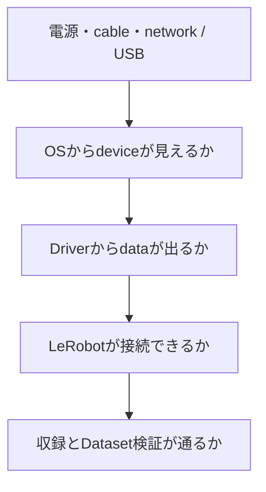

# 04 問題を切り分ける

## 1. この資料の役割

この章は、通常フローが途中で止まったときに、原因がありそうな層を一つずつ調べるために使う。

通常の実行順序は[02 最初のデータを収録する](02_data_collection.md)を参照する。

Troubleshootingでは、error messageだけを検索する前に「どの層まで正常か」を確認する。



上から順に確認すると、例えば「RealSenseがUSB deviceとして見えない問題」と「serialを誤ってconfigへ書いた問題」を分けられる。症状を記録するときは、実行command、最初のerror、直前に変更したもの、再現条件を残す。

安全に関わるArm errorでは、原因調査より先に周囲の安全、保持状態、落下経路を確認する。

### 症状から探す

| 症状 | 最初に読む節 |
|---|---|
| Setupが終了しない | [2. `setup.sh`が失敗する](#2-setupsh-が失敗する) |
| Local configのerror | [3](#3-hardware-localyaml-がない)、[4](#4-replace_with-が残っている) |
| Armが見えない | [5. Arm Controllerが見つからない](#5-arm-controllerが見つからない) |
| Cameraが見えない | [6. RealSenseが認識されない](#6-realsenseが認識されない--configured-serialが見つからない) |
| Armが急停止した | [7. Joint limit](#7-teleoperationが-joint-limit-exceeded-で停止する) |
| Dataset名のerror | [9. Dataset directory already exists](#9-dataset-directory-already-exists) |
| Frame数・rateが想定と違う | [10](#10-frame数が-duration-x-fps-と完全一致しない)、[13](#13-sensorの実測rateが想定と違う) |
| ROS 2 sensorが0 sample | [11. ROS 2 logger](#11-外部ros-2-sensor-loggerが0-sample) |
| 非同期cameraの保存・同期 | [14〜18](#14-gelsightのadvertised-fpsと実測fpsが違う) |

## 2. `setup.sh` が失敗する

### `git` / `uv` が見つからない

```bash
git --version
uv --version
```

不足しているcommandを導入してから再実行する。

### `lerobot_trossen` にlocal modificationがある

```bash
git -C lerobot_trossen status --short
```

必要な変更を退避するか、clean directoryで再構築する。

## 3. `hardware-local.yaml` がない

```bash
cp config/hardware-template.yaml config/hardware-local.yaml
```

[02のStep 4](02_data_collection.md)に従って4 ArmのIPと4 RealSenseのserialを設定する。

## 4. `REPLACE_WITH_...` が残っている

```bash
grep -n 'REPLACE_WITH_' config/hardware-local.yaml
```

出力されたfieldを対象hardwareのidentifierへ置き換える。

## 5. Arm Controllerが見つからない

PC側networkを確認する。

```bash
ip -br addr
```

次にArm Controllerを再探索する。

```bash
(
  cd lerobot_trossen
  uv run trossen-arm discover
)
```

対象IPへの到達性を個別に確認する場合:

```bash
ping -c 2 <ARM_IP>
```

4 Armすべてに到達できない場合は、Arm Controllerの電源とPC側network接続を確認する。

## 6. RealSenseが認識されない / configured serialが見つからない

```bash
(
  cd lerobot_trossen
  uv run lerobot-find-cameras realsense
)
```

4台のD405が検出されることを確認する。

physical roleを再確認する場合は `lerobot_trossen/outputs/captured_images/` の保存画像を確認する。判別しにくい場合は対象cameraを1台ずつ覆って再取得する。

cameraを交換した場合は `config/hardware-local.yaml` の対応serialを更新し、`./check_hardware.sh` を再実行する。

## 7. Teleoperationが `Joint limit exceeded` で停止する

### 症状

```text
Joint limit exceeded
Joint ... velocity limit exceeded
Setting to idle
```

Controllerがidle/error状態へ移行し、Armが現在姿勢で停止する場合がある。

### 起動直後に発生する場合

実機検証では、`./teleoperate.sh` 実行後、Leaderを動かせる状態になってからFollowerの追従loopが開始するまで短い時間差が生じる場合があった。

追従開始前にLeaderを大きく移動すると、Follower追従開始時にLeader/Follower間の姿勢差を一度に追従しようとしてjoint velocity limitへ到達する場合がある。

再実行時は、Leaderを現在位置付近で保持し、小さなLeader動作へFollowerが連続して追従することを確認してから通常操作を開始する。

### 動作中に発生する場合

ログに記録されたjoint番号と、position / velocity / effortのどのlimitを超えたかを確認する。Leaderの急激な操作、mechanical interference、hardware error等を確認する。

### power cycle前の安全確認

**Armがresting positionにない状態でControllerの電源を切る場合は、必ずArmを手で支持するか安全に固定する。**

error停止中に姿勢を保持していても、power offで保持力が失われるとArmが自重で落下する可能性がある。

### 復旧手順

1. teleoperation processが終了していることを確認する
2. 対象Armと周囲の安全を確認する
3. Armがresting positionにない場合はArmを支持する
4. Controllerをpower cycleする
5. 保持力が失われたArmをゆっくり安全な姿勢へ下ろす
6. 再起動後にController状態を確認する

```bash
(
  cd lerobot_trossen
  uv run trossen-arm discover
)
```

対象Armの `Error State` が `No error` であることを確認する。

7. `./teleoperate.sh` を再実行する
8. Followerの追従開始を確認してから通常操作を開始する

同じerrorが繰り返し発生する場合は使用を継続せず、Trossen Armのerror log、joint limit設定、mechanical interference等を確認する。

## 8. Rerun / Vulkan / EGL warningが出る

以下が正常ならteleoperation / recordingを継続できる場合がある。

- Arm controlが継続している
- camera viewが更新されている
- processが異常終了していない
- recording後のDataset validatorがPASSする

viewerを切り離して確認する場合はdisplayを無効にする。

## 9. Dataset directory already exists

`record.sh` は既存datasetを上書きしない。

別の `DATASET_NAME` を使用するか、既存dataが不要であることを確認してから手動で退避・削除する。

## 10. frame数が `duration x fps` と完全一致しない

recording loopの開始・終了境界によりframe数がわずかにずれる場合がある。

`validate_dataset.sh` でmetadata、Parquet、frame ordering、videoを確認する。

## 11. 外部ROS 2 sensor loggerが0 sample

```bash
ros2 topic list
ros2 topic hz /YOUR_TOPIC
ros2 topic info -v /YOUR_TOPIC
```

publisherが動作し、loggerのQoSがpublisherと互換であることを確認する。

## 12. USB serial deviceの固定aliasがない

```bash
ls -l /dev/serial/by-id/
```

必要なら:

```bash
udevadm info --query=property --name=/dev/ttyUSB0 \
  | grep -E 'ID_(MODEL|SERIAL|SERIAL_SHORT)'
```

project-specific local configには安定したdevice identifierを使用する。

## 13. sensorの実測rateが想定と違う

driver設定・timer・device modeと実測rateを確認する。

frame/sample countとtimestampからactual rateを計算する。比較値は[06 実機検証結果と正常性の判断](06_validation_results.md)を参照する。

## 14. GelSightのadvertised FPSと実測FPSが違う

frame count / timestampからactual capture rateを確認する。

実測例は[06 実機検証結果と正常性の判断](06_validation_results.md)を参照する。

## 15. camera保存でrateが大きく低下する

capture pathでdecode、resize、JPEG再encode、per-frame file I/Oを行っていないか確認する。

asynchronous camera referenceではnative compressed streamを保存する。考え方は[03 外部センサを追加する](03_architecture_and_extension.md)を参照する。

## 16. `ffmpeg -copyts` でoutputがemptyになる

reference commandではduration指定の `-t` を `-i` より前に置く。

```bash
ffmpeg \
  -copyts \
  -f v4l2 \
  -input_format mjpeg \
  -video_size 3280x2464 \
  -framerate 25 \
  -timestamps default \
  -t 10 \
  -i "$DEVICE" \
  -c:v copy \
  -avoid_negative_ts disabled \
  output.mkv
```

## 17. camera alignmentで冒頭frameがmissingになる

camera acquisitionをrobot recordingより先に開始する。

最初のrobot timestamp以前にcamera frameが存在しない場合、そのrobot frameはcausal alignment上missingとなる。

## 18. 同じcamera frameが複数robot frameへ割り当てられる

camera rateよりrobot rateが高い場合、causal latest-frame alignmentでは同じcamera frameが複数robot frameから参照される。

raw imageは複製せずmappingを保存する。

## 19. timestampのclock semanticsを確認したい

source/device timestampとhost `CLOCK_MONOTONIC` のclock domainを確認する。

ここで扱うsoftware alignmentではhost monotonic timestampを基準とする。別hardware / driverへ変更した場合は対象timestampのsemanticsを確認する。
