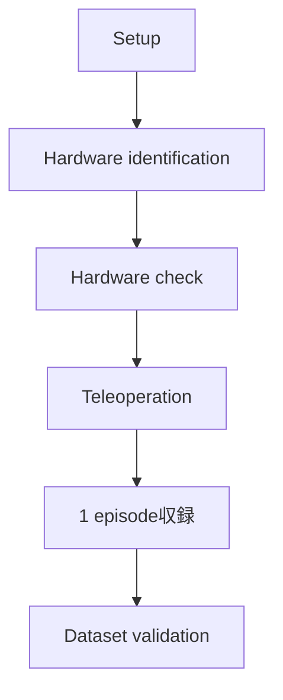

# 05 動作確認済みの環境を変更・保守する

## 1. この資料の役割

この章は、最初の収録に成功した後で、software、Arm、camera、Dataset形式を変更するときに使う。初回構築中はversionを変更せず、まず[02](02_data_collection.md)を完了する。

初回利用手順は[02 最初のデータを収録する](02_data_collection.md)、sensor追加は[03 外部センサを追加する](03_architecture_and_extension.md)、比較値は[06 実機検証結果と正常性の判断](06_validation_results.md)を参照する。

ここでいうmaintenanceは、最新版へ更新し続けることではない。**動作確認済みbaselineを再現できる状態に保ち、変更した場合は影響範囲を特定して必要なacceptance testを再実行すること**である。

変更は次の3種類に分けて考える。

| 変更 | 例 | 主な影響 |
|---|---|---|
| Software | LeRobot、plugin、Python package更新 | API、config field、Dataset schema、timestamp hook |
| Hardware identity / topology | Arm・camera交換、USB port変更 | IP、serial、device mapping、帯域 |
| Data contract | state/action次元、sensor追加 | schema、validator、後段model input |

変更前に現在のcommit、version、configを記録し、変更後は「起動した」だけでなく、該当するend-to-end pathまで再検証する。

## 2. 基本方針

実機で通したrevisionをreferenceとして固定する。

reference versionは[01 使用するソフトウェア](01_reference_stack.md)を正とする。

baselineに影響する変更後は[02](02_data_collection.md)のhardware checkからDataset validationまでを再実行する。

## 3. Trossen / LeRobotを更新する場合

少なくとも以下を確認する。

```text
[ ] dependency resolution
[ ] robot / teleoperator type名
[ ] config field名
[ ] runtime config generation
[ ] Arm connect / disconnect
[ ] teleoperation
[ ] camera acquisition
[ ] one-episode recording
[ ] Dataset schema
[ ] dataset validator
[ ] action保存semantics
[ ] custom robot-frame timestamp sidecar
```

`examples/custom_sensor/record_with_timestamps.py` はLeRobot 0.6.0のrecord loopへ実行時patchを当てる。

upstreamのfunction signature、processor順序、dataset write位置、stop handlingを確認し、timestamp取得位置の意味が維持されていることを確認してから実機smoke testを行う。

## 4. Hardwareを変更する場合

### Arm

Armを交換した場合は、IPとphysical roleを[02](02_data_collection.md)の方法で確認し、

```text
config/hardware-local.yaml
```

の対応fieldを更新する。

### RealSense

camera交換・配置変更時は以下を確認する。

- serial
- physical role
- resolution
- teleoperation時FPS
- recording時FPS

hardware identityは `config/hardware-local.yaml`、resolution / FPS等の用途別設定は `config/teleop-template.yaml` と `config/record-template.yaml` で管理する。

更新後は `./check_hardware.sh`、teleoperation、one-episode recording、dataset validationを再実行する。

### External sensor

device path、serial adapter、topic、driver、native rate、timestamp semanticsを再確認する。

## 5. Configuration fileの役割

| File | 役割 | Git管理 |
|---|---|---|
| `config/hardware-template.yaml` | 実機identifierを記入するtemplate | 対象 |
| `config/hardware-local.yaml` | Arm IPとRealSense serial | 対象外 |
| `config/teleop-template.yaml` | Teleoperation固有設定 | 対象 |
| `config/record-template.yaml` | Recording固有設定 | 対象 |
| `.runtime/*.yaml` | Wrapperが生成するLeRobot実行用config | 対象外 |

hardware identityのfieldを増減した場合は `scripts/build_runtime_config.py`、`check_hardware.sh`、各wrapper、Data Collectionの手順を同時に更新する。

## 6. Public repositoryへ含めない値

tracked fileへ保存しないもの:

- Arm IP address
- RealSense / GelSight / USB adapter等の個体serial
- `/dev/*/by-id/...` の個体固有path
- username / hostnameを含むabsolute path
- 個人・組織固有のdataset namespace

referenceへ残すもの:

- software version
- verified upstream commit
- device model
- resolution / target FPS
- workstation specification
- validationで得たrate / alignment統計

公開前はworking treeとGit historyを確認する。private開発履歴にmachine-specific identifierが含まれる場合は、final treeからclean public historyを作成する。

## 7. Dataset schemaを変更する場合

state / action / camera featureを変更した場合は以下を確認する。

- `meta/info.json` feature shape / type
- Parquet column type / row count
- episode metadata
- video stream数 / resolution / FPS
- loaderで読み込めること
- validatorの期待schema

baseline validatorは4 RGB camera / 14D action / 14D stateを対象とする。featureを変更した場合はvalidatorも更新する。

## 8. External sensor referenceを変更する場合

最低限保持する情報:

```text
sample/frame index
source/device timestamp (availableなら)
host monotonic timestamp
raw data
sensor/config metadata
```

### ROS 2 numeric sensor

確認:

- topic
- message type
- publisher QoS
- actual topic rate
- `header.stamp` semantics

### V4L2 camera

確認:

- device mapping
- advertised format / resolution / FPS
- actual capture rate
- packet timestamp domain
- concurrent robot recordingへの影響

## 9. Provenanceを維持する

vendor公式code、project-specific code、付属reference codeを区別する。

GelSight code provenance:

- GelSight Inc.公式 `gsrobotics`: GelSight Mini用OpenCV based SDK / demo
- project-specific helper: 公式構造をベースに変更されたもの
- project-specific ROS 2 publisher: helperを利用するwrapper
- 付属camera reference: V4L2/FFmpeg + timestamp alignmentとして独立実装

vendor / upstream sourceを成果物へコピーする場合はlicenseと出典を確認する。

## 10. 更新後のacceptance criteria

baselineに影響する変更後:



external sensor codeを変更した場合は、対象sensorのnative acquisition、timestamp semantics、concurrent acquisition、causal alignmentも確認する。

結果は[06](06_validation_results.md)と同じ指標を用い、project-specificな実験記録へ残す。
