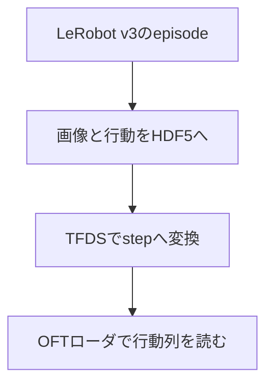

# 09 LeRobotのデモをOpenVLA-OFTへ渡す

[02](02_data_collection.md)で収録した`aloha_vla_demo`を、[08](08_vla_training_inference.md)ではLeRobot内のπ₀.₅とSmolVLAへ渡しました。この章では同じデモを別の研究実装へ渡すときに何が変わるかを、**OpenVLA-OFTの研究グループが公開するALOHA経路**で確かめます。OpenVLAは画像と言葉から行動を出す基盤モデル、OFTはその行動の出し方とfine-tuning方法を改良した発展系です。どちらを研究の起点とするかは[07](07_vla_model_selection.md)で考えます。

この章の到達点は、**自分の`aloha_vla_demo`から1 episodeをLeRobotDataset v3から変換し、OFTの学習用ローダが3視点・14次元状態・30時刻の行動列を出すところまで**です。重みの学習や実機実行は本章に含めません。データの橋渡しを理解した後で、OpenVLA-OFT公開元の[ALOHA手順](https://github.com/moojink/openvla-oft/blob/main/ALOHA.md)と[SETUP](https://github.com/moojink/openvla-oft/blob/main/SETUP.md)を参照して先へ進んでください。

> **動作確認の範囲**：付属export・builder・patchの組合せで、TFDS生成とOFTローダ読込を確認しています。環境導入から本章全手順の一括再現性は未確認です。モデルのfine-tuning・checkpoint推論・実機制御は確認していません。

## 1. なぜ変換するのか

LeRobotDataset v3は画像を動画、関節状態・行動をParquet、episodeの位置をmetadataとして管理します。一方、OpenVLA-OFTのALOHA例は、ALOHA式HDF5から画像を整えた後、**RLDS**に変換し、専用の学習ローダで読みます。RLDSは「episodeの中に順序付きのstepがあり、各stepに観測・行動・言語指示を持つ」という表現です。保存済みMP4を単純に連結したり、拡張子を変えたりしてもこの対応関係は作れません。



| 値 | v3側 | 中間HDF5 | RLDS/OFT側 |
|---|---|---|---|
| 上方画像 | `observation.images.cam_high` | `observations/images/cam_high` | `image` → `image_primary` |
| 左右手首画像 | `cam_left_wrist`, `cam_right_wrist` | 同名 | `left_wrist_image`, `right_wrist_image` → 左右手首入力 |
| 低位置画像 | `cam_low` | `cam_low` | `low_cam_image`として保存。**このOFT設定の学習入力3画像には入れない** |
| 関節状態 | `observation.state` | `observations/qpos` | `observation.state` → `proprio` |
| 人の行動指令 | `action` | `action` | `action`を30時刻のchunkへ |
| 指示文 | `task` | HDF5の`language_instruction`属性 | 各stepの`language_instruction` |

上の矢印は**保存名とローダ上の対応**です。関節の左右順序、単位、グリッパ値、指令が絶対位置か差分かは、別途ロボット側・OFT側の定義と照合してください。数値が14個あるだけでは同じ制御指令とは言えません。元ALOHA形式で最初からHDF5収録する道もありますが、[OpenVLA-OFT公開元の前処理](https://github.com/moojink/openvla-oft/blob/main/experiments/robot/aloha/preprocess_split_aloha_data.py)が要求する`qvel`・`effort`等を含むか確認が必要です。その道でも最終的なRLDS変換とローダへの登録は要ります。本教材のv3データから無理に未収録の`qvel`・`effort`を捏造せず、**公開RLDS builderが実際に読む項目**へ橋渡しします。

## 2. まず1 episodeで変換を確かめる

手元のv3データを使います。08から同じ端末で続ける場合は設定済みの値を使います。新しい端末、または本章から始める場合は、[02の作業場所の設定](02_data_collection.md#作業場所の設定)と[08のデータの場所の指定](08_vla_training_inference.md#学習に使うデータの場所を指定する)を行ってください。08の学習を実行しておく必要はありません。

この章では変換結果と専用環境を教材と同じ親ディレクトリに置きます。`session.sh`が用意する初期値は次のとおりです。これらのディレクトリは、対応する手順で作成します。

| 変数 | 初期値・用途 |
|---|---|
| `BRIDGE` | 教材と同じ親ディレクトリの`openvla_oft_bridge/`。変換結果 |
| `BUILDER_ENV` | 同じ親ディレクトリの`rlds-builder-env/`。RLDS builder環境 |

初期値で進める場合は入力不要です。別の保存先が必要な場合だけ、変換前に次を実行して指定します。

```bash
read -r -p "変換結果の保存先ディレクトリ: " BRIDGE
export BRIDGE
read -r -p "RLDS builder環境のディレクトリ: " BUILDER_ENV
export BUILDER_ENV
```

`TROSSEN`は[01](01_reference_stack.md)で構築した`lerobot_trossen`、`BRIDGE`は**リポジトリ外**の作業領域です。元データの名前は変更しません。変換先の`aloha_vla_demo`は付属builder・patchに対応する名前なので維持します。

```bash
cd "$REPO"
TROSSEN="$REPO/lerobot_trossen"
test -d "$DATASET"
mkdir -p "$BRIDGE/aloha_vla_demo/train"

cd "$TROSSEN"
uv run --with h5py python \
  "$REPO/examples/openvla_oft/export_lerobot_v3_episode.py" \
  --source "$DATASET" --episode 0 \
  --output "$BRIDGE/aloha_vla_demo/train/episode_0.hdf5"
```

これは変換試験用の**1件だけ**です。出力先が既に存在すると上書きせず停止します。出力したHDF5のフレーム数、fps、4画像、状態と行動を次のコマンドで確認します。画像を元の424×240から正方形にする処理は幾何を変えるため、研究で用いる場合はcrop・resizeと対象物の見え方を自分のデータで確認してください。自分のデモでも次のshapeとtaskを読み戻してから先へ進みます。

```bash
HDF5="$BRIDGE/aloha_vla_demo/train/episode_0.hdf5"
cd "$TROSSEN"
HDF5="$HDF5" uv run --with h5py python - <<'PY'
import os
import h5py
with h5py.File(os.environ["HDF5"], "r") as f:
    n = f["action"].shape[0]
    assert f["observations/qpos"].shape == (n, 14)
    for name in ("cam_high", "cam_low", "cam_left_wrist", "cam_right_wrist"):
        assert f["observations/images"][name].shape == (n, 256, 256, 3)
    print("frames:", n, "fps:", f.attrs["fps"])
    print("task:", f.attrs["language_instruction"])
PY
```

## 3. 公開builderを使ってRLDSにする

OFT公開元が案内する[ALOHA用RLDS builder](https://github.com/moojink/rlds_dataset_builder/tree/main/aloha1_put_X_into_pot_300_demos)を4画像と指示文に合わせたものが`examples/openvla_oft/aloha_vla_demo/`です。この公開builderを基にする理由は、RLDSのepisode/step構造とOFTの期待するフィールド名を一から推測せずに済むためです。ただし`LeRobotDataset v3 → 中間HDF5`は本教材で追加したコードで、LeRobot標準のOFT変換コマンドではありません。

本教材の変換を確認した環境はPython 3.9、`tensorflow==2.13.0`、`tensorflow-datasets==4.9.2`、`h5py==3.9.0`、`numpy==1.24.3`でした。例えば次のように専用仮想環境を用意します。

```bash
uv venv --python 3.9 "$BUILDER_ENV"
uv pip install --python "$BUILDER_ENV/bin/python" \
  'tensorflow==2.13.0' 'tensorflow-datasets==4.9.2' \
  'h5py==3.9.0' 'numpy==1.24.3'

BUILDER="$REPO/examples/openvla_oft"
cd "$BUILDER/aloha_vla_demo"
ALOHA_HDF5_ROOT="$BRIDGE/aloha_vla_demo" \
PYTHONPATH="$BUILDER" CUDA_VISIBLE_DEVICES= TF_CPP_MIN_LOG_LEVEL=2 \
"$BUILDER_ENV/bin/tfds" build --data_dir="$BRIDGE/tfds"
```

builderには`ALOHA_HDF5_ROOT`でHDF5の場所を渡します。初回は1 episodeを変換し、TFDSに`train: 1 episode`と表示されることを確認してください。これは形式の接続試験で、モデルの性能を評価するデータ量ではありません。

生成物の内容を元のHDF5と照合します。TFDSはepisodeを1件、その中のstepを**自分のHDF5と同じ数**だけ返すはずです。

```bash
HDF5="$BRIDGE/aloha_vla_demo/train/episode_0.hdf5" \
TFDS_ROOT="$BRIDGE/tfds/aloha_vla_demo/1.0.0" \
CUDA_VISIBLE_DEVICES= TF_CPP_MIN_LOG_LEVEL=2 \
TF_NUM_INTEROP_THREADS=2 TF_NUM_INTRAOP_THREADS=2 \
"$BUILDER_ENV/bin/python" - <<'PY'
import os
import h5py
import numpy as np
import tensorflow_datasets as tfds
builder = tfds.builder_from_directory(os.environ["TFDS_ROOT"])
assert builder.info.splits["train"].num_examples == 1
episode = next(iter(builder.as_dataset(split="train", shuffle_files=False)))
with h5py.File(os.environ["HDF5"], "r") as source:
    n = len(source["action"])
    count = 0
    for i, step in enumerate(tfds.as_numpy(episode["steps"])):
        if i in (0, n // 2, n - 1):
            np.testing.assert_array_equal(step["action"], source["action"][i])
            np.testing.assert_array_equal(
                step["observation"]["state"], source["observations/qpos"][i]
            )
            assert step["observation"]["image"].shape == (256, 256, 3)
            task = step["language_instruction"].decode("utf-8")
            assert task == source.attrs["language_instruction"]
        assert bool(step["is_first"]) == (i == 0)
        assert bool(step["is_last"]) == (i == n - 1)
        count += 1
    assert count == n
print("RLDS READBACK: PASS; frames=", count)
PY
```

上の読み戻しで、先頭・中間・末尾のstate/action/task、全stepの区切りと件数を自分のHDF5と照合してください。TFDS内部のJPEG再圧縮後の画像ピクセルはHDF5との完全一致を要求しません。画像はshapeだけでなく、色・左右カメラの対応を数枚目視してください。

## 4. OFT側の入口を合わせる

OFT側はLeRobotの`lerobot-train`とは別のPython環境です。依存条件はOpenVLA-OFT公開元の[SETUP](https://github.com/moojink/openvla-oft/blob/e4287e94541f459edc4feabc4e181f537cd569a8/SETUP.md)を参照します。公式はCondaを案内していますが、本章でローダ接続を確認したのはuvで用意した仮想環境です。以下のコマンドは、OFT用の依存が入った`$OFT/.venv/bin/python`を使う前提です。公式のConda手順だけではこのパスは作られません。Condaを選ぶ場合は実行Pythonの指定をその環境に合わせる必要があり、本章ではその経路を確認していません。

ここで`OFT`に、準備したOpenVLA-OFTリポジトリの場所を指定します。初期値は教材と同じ親ディレクトリの`openvla-oft/`です。その場所に用意した場合は入力不要です。別の場所の既存環境を使う場合だけ次を実行してください。パスの指定だけでは、リポジトリやPython環境は作成されません。

```bash
read -r -p "OpenVLA-OFTのディレクトリ: " OFT
export OFT
test -d "$OFT"
```

commit `e4287e94541f459edc4feabc4e181f537cd569a8`に固定したリポジトリへ、`examples/openvla_oft/openvla_oft_aloha.patch`を適用します。適用前に`git status`で手元の変更を確認し、同じ差分を二重適用しないでください。

```bash
test -d "$OFT"
cd "$OFT"
git status --short
git rev-parse HEAD
git apply --check "$REPO/examples/openvla_oft/openvla_oft_aloha.patch"
git apply "$REPO/examples/openvla_oft/openvla_oft_aloha.patch"
git diff --check
```

パッチは`configs.py`で14次元の双腕状態・行動と画像名、`transforms.py`でALOHA用整形、`mixtures.py`でdataset名を登録します。さらに`constants.py`をALOHA・30時刻に設定します。OFTのデータローダは`data_mix`名に`aloha`が含まれると左右手首の2画像を追加で読みます。そこでTFDSのdataset名とOFTのmixture名を**ともに`aloha_vla_demo`**としています。単にカメラ画像をRLDSへ入れるだけではOFTの学習入力には届きません。

OpenVLA-OFTの[ALOHA手順](https://github.com/moojink/openvla-oft/blob/main/ALOHA.md)では25時刻は25 Hzで約1秒に相当します。[02](02_data_collection.md)の30 Hzデータには30時刻を選びます。**30 Hzで記録した元データを取り直す必要はありません。** `ACTION_PROPRIO_NORMALIZATION_TYPE`はALOHA用の`bounds`を維持します。公開元はabsolute joint actionで外れ値を刈り込む方式を避ける理由を説明しています。設定は物理的な意味の一致を証明しないため、学習前に値域と関節対応を調べてください。

OFT環境で依存が衝突するときは`uv pip check --python "$OFT/.venv/bin/python"`で原因を確かめます。動作確認時の組合せは`tensorflow==2.15.0`、`tensorflow-datasets==4.9.3`、`tensorflow-metadata==1.17.3`、`protobuf==4.25.9`です。`tensorflow-metadata==1.15.0`を入れると`protobuf==3.20.3`が選ばれ、`wandb`の要求と衝突する場合がありました。無関係な最新版への一律更新は避けてください。

最後にOpenVLA-OFTの**学習用データローダ**まで通します。推論モデルのロードや重みの学習ではありません。

```bash
cd "$OFT"
PYTHONPATH="$BUILDER:$OFT" \
RLDS_ROOT="$BRIDGE/tfds" \
CUDA_VISIBLE_DEVICES= TF_CPP_MIN_LOG_LEVEL=2 \
TF_NUM_INTEROP_THREADS=2 TF_NUM_INTRAOP_THREADS=2 \
"$OFT/.venv/bin/python" - <<'PY'
import os
import numpy as np
import aloha_vla_demo.aloha_vla_demo_dataset_builder
from prismatic.vla.datasets.datasets import RLDSDataset

ds = RLDSDataset(
    data_root_dir=os.environ["RLDS_ROOT"],
    data_mix="aloha_vla_demo",
    batch_transform=lambda x: x,
    resize_resolution=(224, 224),
    shuffle_buffer_size=32,
    image_aug=False,
    train=True,
)
sample = next(iter(ds))
assert tuple(sample["action"].shape) == (30, 14)
assert tuple(sample["observation"]["proprio"].shape) == (1, 14)
for key in ("image_primary", "image_left_wrist", "image_right_wrist"):
    assert tuple(sample["observation"][key].shape) == (1, 224, 224, 3)
assert np.isfinite(sample["action"]).all()
print("OFT DATA LOADER: PASS")
PY
```

上のコマンドが通れば、ローダから3画像、`proprio (1,14)`、`action (30,14)`が取り出せます。先の変換処理ではGPUを隠しているため、TensorFlowのCUDA初期化メッセージはデータ変換失敗を意味しません。自分の環境では上のassertionとプロセスの終了状態を確認してください。

## 5. 研究用の学習へ広げる前に

ここまでの確認は**接続試験**です。1 episodeだけを変換する例には検証用splitがなく、OFTの学習やモデル評価には使えません。本当に学習するなら、成功した全training episodeを出力し、分離したholdoutは`val/`へ置き、builderにvalidation splitを追加してから、episode数・step数・指示文・画像とactionの値域を再確認します。公開例の学習ステップ数やGPU数を、そのまま自分のデータに転用しないでください。

収録から選び直せるなら元ALOHAのHDF5経路も候補です。既存のデモは、モデルを変えるたびに取り直す前に変換可能かを検討します。まず既存データを保持し、必要な観測と意味を失わない変換ができるかを試します。変換時に存在しないセンサ値を補ったり、元の30 Hzを「25 Hz収録」として扱ったりしません。OpenVLA-OFTコードでのfine-tuning、checkpointの推論と実機接続は別の検証項目です。

### この章で確認できる範囲

`LeRobotDataset v3 → HDF5 → TFDS/RLDS → OFTローダ`を、1 episodeで追えます。配布した変換スクリプトとbuilder、OFTパッチの組合せは、元データ598 frameの例でTFDS生成とOFTローダの`(30, 14)`出力まで確認しています。重みのfine-tuning、checkpointからの推論と実機制御はこの章の対象外です。元のbuilderはcommit `6174b0b6bb69df6361f1117944952bf14afb0cc3`、OFTは`e4287e94541f459edc4feabc4e181f537cd569a8`です。公開元の[ALOHA.md](https://github.com/moojink/openvla-oft/blob/main/ALOHA.md)と[RLDS builder例](https://github.com/moojink/rlds_dataset_builder)も参照してください。
