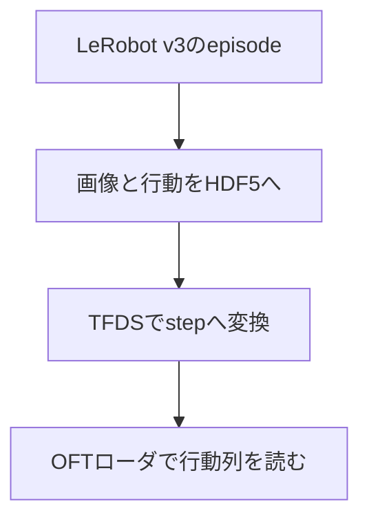

# 09 LeRobotのデモをOpenVLA-OFTへ渡す

[02](02_data_collection.md)で収録した`aloha_vla_demo`を、[08](08_vla_training_inference.md)ではLeRobot内のπ₀.₅とSmolVLAへ渡しました。この章では同じデモを別の研究実装へ渡すときに何が変わるかを、**OpenVLA-OFTの研究グループが公開するALOHA経路**で確かめます。OpenVLAは画像と言葉から行動を出す基盤モデル、OFTはその行動の出し方とfine-tuning方法を改良した発展系です。どちらを研究の起点とするかは[07](07_vla_model_selection.md)で考えます。

この章の到達点は、**自分の`aloha_vla_demo`から1 episodeをLeRobotDataset v3から変換し、OFTの学習用ローダが3視点・14次元状態・30時刻の行動列を出すところまで**です。第5節では全episodeの変換と短い学習・保存・オフライン推論まで進みます。実機実行は別の検証項目です。データの橋渡しを理解した後で、OpenVLA-OFT公開元の[ALOHA手順](https://github.com/moojink/openvla-oft/blob/main/ALOHA.md)と[SETUP](https://github.com/moojink/openvla-oft/blob/main/SETUP.md)を参照して先へ進んでください。

> **動作確認の範囲**：Ubuntu 22.04.5のRTX A6000ワークステーションで、新規builder・OFT仮想環境の導入、1 episodeの変換・読み戻し・OFTローダ読込を確認しています。2026年10月2日、教材commit `7b9cd7f`の第2〜4節を順に再実行し、HDF5出力、TFDS生成・598 frameの読み戻し、専用環境の作成・依存チェック、パッチ適用、`OFT DATA LOADER: PASS`まで確認しました。builderはPython 3.9.25、OFTはPython 3.10.12です。既存OS・uv・パッケージキャッシュと収録済みデータは利用しており、OSを含む完全なクリーン環境の検証ではありません。2026年10月5日に同じ環境で全50 episode・29,947 frameの変換と照合、短いfine-tuning・保存・checkpoint推論まで追加確認しました。実機制御とタスク性能は未確認です。

## 1. なぜ変換するのか

LeRobotDataset v3は画像を動画、関節状態・行動をParquet、episodeの位置をmetadataとして管理します。一方、OpenVLA-OFTのALOHA例は、ALOHA式HDF5から画像を整えた後、**RLDS**に変換し、専用の学習ローダで読みます。RLDSは「episodeの中に順序付きのstepがあり、各stepに観測・行動・言語指示を持つ」という表現です。保存済みMP4を単純に連結したり、拡張子を変えたりしてもこの対応関係は作れません。



| 値 | v3側 | 中間HDF5 | RLDS/OFT側 |
|---|---|---|---|
| 上方画像 | `observation.images.cam_high` | `observations/images/cam_high` | `image` → `image_primary` |
| 左右手首画像 | `cam_left_wrist`, `cam_right_wrist` | 同名 | `left_wrist_image`, `right_wrist_image` → 左右手首入力 |
| 低位置画像 | `cam_low` | `cam_low` | `low_cam_image`として保存。**このOFT設定の学習入力3画像には入れない** |
| 関節状態 | `observation.state` | `observations/qpos` | `observation.state` → `proprio` |
| 人の行動指令 | `action` | `action` | `action`を30時刻のchunkへ |
| 指示文 | `task` | HDF5の`language_instruction`属性 | 各stepの`language_instruction` |

上の矢印は**保存名とローダ上の対応**です。関節の左右順序、単位、グリッパ値、指令が絶対位置か差分かは、別途ロボット側・OFT側の定義と照合してください。数値が14個あるだけでは同じ制御指令とは言えません。元ALOHA形式で最初からHDF5収録する道もありますが、[OpenVLA-OFT公開元の前処理](https://github.com/moojink/openvla-oft/blob/main/experiments/robot/aloha/preprocess_split_aloha_data.py)が要求する`qvel`・`effort`等を含むか確認が必要です。その道でも最終的なRLDS変換とローダへの登録は要ります。本教材のv3データから無理に未収録の`qvel`・`effort`を捏造せず、**公開RLDS builderが実際に読む項目**へ橋渡しします。

## 2. まず1 episodeで変換を確かめる

手元のv3データを使います。08から同じターミナルで続ける場合は設定済みの値を使います。新しいターミナル、または本章から始める場合は、[02の作業場所の設定](02_data_collection.md#作業場所の設定)と[08のデータの場所の指定](08_vla_training_inference.md#学習に使うデータの場所を指定する)を行ってください。08の学習を実行しておく必要はありません。

この章では変換結果と専用環境を教材と同じ親ディレクトリに置きます。`session.sh`が用意する初期値は次のとおりです。これらのディレクトリは、対応する手順で作成します。

| 変数 | 初期値・用途 |
|---|---|
| `BRIDGE` | 教材と同じ親ディレクトリの`openvla_oft_bridge/`。変換結果 |
| `BUILDER_ENV` | 同じ親ディレクトリの`rlds-builder-env/`。RLDS builder環境 |

初期値で進める場合は入力不要です。別の保存先が必要な場合だけ、変換前に次を実行して指定します。各`read`で入力待ちになるので、表示された問いにパスを入力し、Enterを押します。`export`は通常、何も表示しません。

```bash
read -r -p "変換結果の保存先ディレクトリ: " BRIDGE
export BRIDGE
read -r -p "RLDS builder環境のディレクトリ: " BUILDER_ENV
export BUILDER_ENV
```

入力例（表示例。パスは自分の保存先を使います）：

```text
変換結果の保存先ディレクトリ: /mnt/data/openvla_oft_bridge
RLDS builder環境のディレクトリ: /mnt/data/rlds-builder-env
```

`TROSSEN`は[01](01_reference_stack.md)で構築した`lerobot_trossen`、`BRIDGE`は**リポジトリ外**の作業領域です。元データの名前は変更しません。変換先の`aloha_vla_demo`は付属builder・patchに対応する名前なので維持します。

```bash
cd "$REPO"
TROSSEN="$REPO/lerobot_trossen"
test -d "$DATASET"
mkdir -p "$BRIDGE/aloha_vla_demo/train"

cd "$TROSSEN"
uv run --with h5py python \
  "$REPO/examples/openvla_oft/export_lerobot_v3_episode.py" \
  --source "$DATASET" --episode 0 \
  --output "$BRIDGE/aloha_vla_demo/train/episode_0.hdf5"
```

これは変換試験用の**1件だけ**です。出力先が既に存在すると上書きせず停止します。出力したHDF5のフレーム数、fps、4画像、状態と行動を次のコマンドで確認します。画像を元の424×240から正方形にする処理は幾何を変えるため、研究で用いる場合はcrop・resizeと対象物の見え方を自分のデータで確認してください。自分のデモでも次のshapeとtaskを読み戻してから先へ進みます。

```bash
HDF5="$BRIDGE/aloha_vla_demo/train/episode_0.hdf5"
cd "$TROSSEN"
HDF5="$HDF5" uv run --with h5py python - <<'PY'
import os
import h5py
with h5py.File(os.environ["HDF5"], "r") as f:
    n = f["action"].shape[0]
    assert f["observations/qpos"].shape == (n, 14)
    for name in ("cam_high", "cam_low", "cam_left_wrist", "cam_right_wrist"):
        assert f["observations/images"][name].shape == (n, 256, 256, 3)
    print("frames:", n, "fps:", f.attrs["fps"])
    print("task:", f.attrs["language_instruction"])
PY
```

## 3. 公開builderを使ってRLDSにする

OFT公開元が案内する[ALOHA用RLDS builder](https://github.com/moojink/rlds_dataset_builder/tree/main/aloha1_put_X_into_pot_300_demos)を4画像と指示文に合わせたものが`examples/openvla_oft/aloha_vla_demo/`です。この公開builderを基にする理由は、RLDSのepisode/step構造とOFTの期待するフィールド名を一から推測せずに済むためです。ただし`LeRobotDataset v3 → 中間HDF5`は本教材で追加したコードで、LeRobot標準のOFT変換コマンドではありません。

本教材の変換を確認した環境はPython 3.9、`tensorflow==2.13.0`、`tensorflow-datasets==4.9.2`、`h5py==3.9.0`、`numpy==1.24.3`でした。例えば次のように専用仮想環境を用意します。

```bash
cd "$REPO"
uv venv --python 3.9 "$BUILDER_ENV"
uv pip install --python "$BUILDER_ENV/bin/python" \
  'tensorflow==2.13.0' 'tensorflow-datasets==4.9.2' \
  'h5py==3.9.0' 'numpy==1.24.3'

BUILDER="$REPO/examples/openvla_oft"
cd "$BUILDER/aloha_vla_demo"
ALOHA_HDF5_ROOT="$BRIDGE/aloha_vla_demo" \
PYTHONPATH="$BUILDER" CUDA_VISIBLE_DEVICES= TF_CPP_MIN_LOG_LEVEL=2 \
"$BUILDER_ENV/bin/tfds" build --data_dir="$BRIDGE/tfds"
```

builderには`ALOHA_HDF5_ROOT`でHDF5の場所を渡します。初回は1 episodeを変換し、TFDSに`train: 1 episode`と表示されることを確認してください。これは形式の接続試験で、モデルの性能を評価するデータ量ではありません。

生成物の内容を元のHDF5と照合します。TFDSはepisodeを1件、その中のstepを**自分のHDF5と同じ数**だけ返すはずです。

```bash
HDF5="$BRIDGE/aloha_vla_demo/train/episode_0.hdf5" \
TFDS_ROOT="$BRIDGE/tfds/aloha_vla_demo/1.0.0" \
CUDA_VISIBLE_DEVICES= TF_CPP_MIN_LOG_LEVEL=2 \
TF_NUM_INTEROP_THREADS=2 TF_NUM_INTRAOP_THREADS=2 \
"$BUILDER_ENV/bin/python" - <<'PY'
import os
import h5py
import numpy as np
import tensorflow_datasets as tfds
builder = tfds.builder_from_directory(os.environ["TFDS_ROOT"])
assert builder.info.splits["train"].num_examples == 1
episode = next(iter(builder.as_dataset(split="train", shuffle_files=False)))
with h5py.File(os.environ["HDF5"], "r") as source:
    n = len(source["action"])
    count = 0
    for i, step in enumerate(tfds.as_numpy(episode["steps"])):
        if i in (0, n // 2, n - 1):
            np.testing.assert_array_equal(step["action"], source["action"][i])
            np.testing.assert_array_equal(
                step["observation"]["state"], source["observations/qpos"][i]
            )
            assert step["observation"]["image"].shape == (256, 256, 3)
            task = step["language_instruction"].decode("utf-8")
            assert task == source.attrs["language_instruction"]
        assert bool(step["is_first"]) == (i == 0)
        assert bool(step["is_last"]) == (i == n - 1)
        count += 1
    assert count == n
print("RLDS READBACK: PASS; frames=", count)
PY
```

上の読み戻しで、先頭・中間・末尾のstate/action/task、全stepの区切りと件数を自分のHDF5と照合してください。TFDS内部のJPEG再圧縮後の画像ピクセルはHDF5との完全一致を要求しません。画像はshapeだけでなく、色・左右カメラの対応を数枚目視してください。

## 4. OFT側の入口を合わせる

OFT側はLeRobotの`lerobot-train`とは別のPython環境です。OpenVLA-OFT公開元の[固定版SETUP](https://github.com/moojink/openvla-oft/blob/e4287e94541f459edc4feabc4e181f537cd569a8/SETUP.md)はCondaとPython 3.10を案内しています。本教材ではuvの専用仮想環境を使います。LeRobot用環境や第3節のbuilder環境にはOFTの依存を入れません。

### 4.1 OFTリポジトリと専用環境を用意する

`OFT`の初期値は教材と同じ親ディレクトリの`openvla-oft/`です。新しく用意する場合は、そのまま下の取得手順へ進みます。別の場所の既存環境を使う場合だけ次を実行してください。`read`で入力待ちになったらパスを入力し、Enterを押します。

```bash
read -r -p "OpenVLA-OFTのディレクトリ: " OFT
export OFT
```

例えば既存の取得先が`/mnt/data/openvla-oft`なら、入力は`OpenVLA-OFTのディレクトリ: /mnt/data/openvla-oft`となります。引用符は入力しません。

次の手順は、存在しない場所にはリポジトリを取得し、既存の場所ではGitリポジトリ・公開元・未変更状態を確認します。変更済みの場合は停止するので、変更を消さず、新しい作業場所を選んでください。丸括弧内で失敗すると、そのブロックの後続処理は実行されません。

```bash
(
  set -e
  cd "$REPO"
  if [ ! -e "$OFT" ]; then
    git clone https://github.com/moojink/openvla-oft.git "$OFT"
  fi
  test -d "$OFT/.git"
  test "$(git -C "$OFT" remote get-url origin)" = "https://github.com/moojink/openvla-oft.git"
  test -z "$(git -C "$OFT" status --porcelain)"
  git -C "$OFT" fetch origin e4287e94541f459edc4feabc4e181f537cd569a8
  git -C "$OFT" checkout --detach e4287e94541f459edc4feabc4e181f537cd569a8
  cd "$OFT"
  uv venv --python 3.10 .venv
  uv pip install --python "$OFT/.venv/bin/python" -e . \
    'numpy==1.26.4' 'protobuf==4.25.9' \
    'tensorflow-metadata==1.17.3' \
    'huggingface-hub==0.36.2' \
    'accelerate==1.15.0' 'wandb==0.28.0' \
    'transformers @ git+https://github.com/moojink/transformers-openvla-oft.git@bc339d9ad707454c0c115970db43c260067c61ab' \
    'dlimp @ git+https://github.com/moojink/dlimp_openvla@040105d256bd28866cc6620621a3d5f7b6b91b46'
  uv pip check --python "$OFT/.venv/bin/python"
)
```

**完了条件**：インストールが成功し、`uv pip check`で依存の不整合がないこと。エラーが出たら第4.2節へ進まず、ログを確認してください。上の依存導入コマンドはPython 3.10.12の新規仮想環境で成功し、ローダ読込まで確認しています。主要依存とGit版を明示していますが、全依存のlockではありません。[固定版の依存定義](https://github.com/moojink/openvla-oft/blob/e4287e94541f459edc4feabc4e181f537cd569a8/pyproject.toml)に従ってPyTorch 2.2.0とTensorFlow 2.15.0等が入ります。公式SETUPのFlash Attention導入は学習向けです。第4節のローダ確認では導入しません。第5節の短い学習とcheckpoint推論も追加導入なしで通りましたが、すべての学習設定で不要という意味ではありません。

### 4.2 ALOHA用パッチを適用する

固定したOFTリポジトリへ`examples/openvla_oft/openvla_oft_aloha.patch`を適用します。同じ差分を二重適用しないでください。

```bash
(
  set -e
  test -d "$OFT/.git"
  cd "$OFT"
  test "$(git rev-parse HEAD)" = "e4287e94541f459edc4feabc4e181f537cd569a8"
  git status --short
  git apply --check "$REPO/examples/openvla_oft/openvla_oft_aloha.patch"
  git apply "$REPO/examples/openvla_oft/openvla_oft_aloha.patch"
  git diff --check
)
```

パッチは`configs.py`で14次元の双腕状態・行動と画像名、`transforms.py`でALOHA用整形、`mixtures.py`でdataset名を登録します。さらに`constants.py`をALOHA・30時刻に設定します。OFTのデータローダは`data_mix`名に`aloha`が含まれると左右手首の2画像を追加で読みます。そこでTFDSのdataset名とOFTのmixture名を**ともに`aloha_vla_demo`**としています。単にカメラ画像をRLDSへ入れるだけではOFTの学習入力には届きません。

OpenVLA-OFTの[ALOHA手順](https://github.com/moojink/openvla-oft/blob/main/ALOHA.md)では25時刻は25 Hzで約1秒に相当します。[02](02_data_collection.md)の30 Hzデータには30時刻を選びます。**30 Hzで記録した元データを取り直す必要はありません。** `ACTION_PROPRIO_NORMALIZATION_TYPE`はALOHA用の`bounds`を維持します。公開元はabsolute joint actionで外れ値を刈り込む方式を避ける理由を説明しています。設定は物理的な意味の一致を証明しないため、学習前に値域と関節対応を調べてください。

OFT環境で依存が衝突するときは`uv pip check --python "$OFT/.venv/bin/python"`で原因を確かめます。動作確認時の組合せは`tensorflow==2.15.0`、`tensorflow-datasets==4.9.3`、`tensorflow-metadata==1.17.3`、`protobuf==4.25.9`です。`tensorflow-metadata==1.15.0`を入れると`protobuf==3.20.3`が選ばれ、`wandb`の要求と衝突する場合がありました。無関係な最新版への一律更新は避けてください。

最後にOpenVLA-OFTの**学習用データローダ**まで通します。推論モデルのロードや重みの学習ではありません。

```bash
cd "$OFT" && \
PYTHONPATH="$BUILDER:$OFT" \
RLDS_ROOT="$BRIDGE/tfds" \
CUDA_VISIBLE_DEVICES= TF_CPP_MIN_LOG_LEVEL=2 \
TF_NUM_INTEROP_THREADS=2 TF_NUM_INTRAOP_THREADS=2 \
"$OFT/.venv/bin/python" - <<'PY'
import os
import numpy as np
import aloha_vla_demo.aloha_vla_demo_dataset_builder
from prismatic.vla.datasets.datasets import RLDSDataset

ds = RLDSDataset(
    data_root_dir=os.environ["RLDS_ROOT"],
    data_mix="aloha_vla_demo",
    batch_transform=lambda x: x,
    resize_resolution=(224, 224),
    shuffle_buffer_size=32,
    image_aug=False,
    train=True,
)
sample = next(iter(ds))
assert tuple(sample["action"].shape) == (30, 14)
assert tuple(sample["observation"]["proprio"].shape) == (1, 14)
for key in ("image_primary", "image_left_wrist", "image_right_wrist"):
    assert tuple(sample["observation"][key].shape) == (1, 224, 224, 3)
assert np.isfinite(sample["action"]).all()
print("OFT DATA LOADER: PASS")
PY
```

今回の確認ではFlash Attentionを導入せず、このローダのassertionと`OFT DATA LOADER: PASS`まで通りました。

上のコマンドが通れば、ローダから3画像、`proprio (1,14)`、`action (30,14)`が取り出せます。本章の変換・ローダ確認では`CUDA_VISIBLE_DEVICES=`でGPUを非表示にしています。確認時はTensorFlowのCUDA初期化・factory重複メッセージが出ましたが、読み戻しとローダのPASSまで完了しました。メッセージだけで成否を判断せず、自分の環境では上のassertionとプロセスの終了状態を確認してください。

### 同じデータで手順を再実行する場合

元のDatasetはそのまま使います。変換先のHDF5が既に存在するとexportは停止し、生成済みTFDSは再利用されます。また、適用済みパッチをもう一度適用すると失敗します。新規作成から確認したい場合は、第2節で`BRIDGE`・`BUILDER_ENV`に、第4.1節で`OFT`に、既存試行とは別の未使用ディレクトリを指定して進めてください。既存の成果や環境を削除する必要はありません。名前の入力と`export`は各節の方法を使います。

## 5. 全episodeから短い学習・保存・推論まで通す

第2〜4節の1 episode確認が通ってから進みます。既存のbuilder・OFT環境と適用済みパッチを使い、変換結果は別の新規ディレクトリへ出します。環境を作り直したり、パッチを再適用したりする必要はありません。この節の補助コードは2026年10月5日のGPU実行で使用したものです。公式trainerは変更せず、builder登録とTensorFlowのGPU使用を切り分ける入口を用意しています。

### 5.1 作業先と全episodeの変換

02の作業場所と08の`DATASET`、本章の`OFT`・`BUILDER_ENV`が設定されたターミナルで実行します。`WORK`は今回の変換・重み・checkpointを保存する場所です。入力待ちになったら、未使用の保存先を入力してEnterを押してください。データ50 episodeのHDF5だけで約23.6 GB、さらにRLDS・基盤重みのキャッシュ・作業コピー・merged checkpointが必要です。空き容量に余裕のある領域を使います。

```bash
read -r -p "追加検証の新規保存先ディレクトリ: " WORK
export WORK
mkdir "$WORK"
export BUILDER="$REPO/examples/openvla_oft"
export TOOLS="$REPO/examples/openvla_oft"
export HF_HUB_CACHE="$WORK/hf_hub_cache"
export TMPDIR="$WORK/tmp"
mkdir -p "$HF_HUB_CACHE" "$TMPDIR"
```

入力例は`追加検証の新規保存先ディレクトリ: /mnt/data/oft_validation_run1`です。`mkdir`が失敗したら続けず、保存先を確認します。キャッシュと一時領域の指定も、以降同じターミナルで維持します。別のターミナルで続ける場合は同じ変数を設定し直してください。長時間の処理はtmux等でSSH切断後も継続できるようにします。

```bash
cd "$REPO/lerobot_trossen"
uv run --with h5py python "$TOOLS/export_all_episodes.py" \
  --source "$DATASET" \
  --exporter "$TOOLS/export_lerobot_v3_episode.py" \
  --output "$WORK/aloha_vla_demo"

cd "$BUILDER/aloha_vla_demo"
ALOHA_HDF5_ROOT="$WORK/aloha_vla_demo" \
PYTHONPATH="$BUILDER" CUDA_VISIBLE_DEVICES= TF_CPP_MIN_LOG_LEVEL=2 \
"$BUILDER_ENV/bin/tfds" build --data_dir="$WORK/tfds"
```

全件exporterは既存の1 episode変換コードを順に呼び、manifestにepisodeとframe数を残します。保存先が既にあると停止するため、途中失敗時は上書きせず原因を確認します。次にHDF5とRLDSのstate・action・指示文を全stepで照合し、episode境界と件数も確認します。画像の左右・視点・色・時刻の目視確認は別に行います。

```bash
WORK="$WORK" CUDA_VISIBLE_DEVICES= TF_CPP_MIN_LOG_LEVEL=2 \
TF_NUM_INTEROP_THREADS=2 TF_NUM_INTRAOP_THREADS=2 \
"$BUILDER_ENV/bin/python" "$TOOLS/verify_full_rlds.py"
```

**完了条件**：`FULL EXPORT: PASS`と`FULL RLDS READBACK: PASS`、自分のDatasetと同じ件数。確認例は50 episode・29,947 frameです。今回のbuilderはtrainだけで、未知データの評価にはなりません。評価まで行う場合はepisode単位でholdoutを分離し、builderにvalidation splitを追加します。全件をtrainへ置いたまま`use_val_set=True`にしないでください。

### 5.2 基盤重みを作業用コピーへ置く

```bash
cd "$OFT"
uv pip check --python "$OFT/.venv/bin/python"
"$OFT/.venv/bin/python" "$TOOLS/prepare_oft_base.py" \
  --output "$WORK/openvla_base"
```

この補助コードは`openvla/openvla-7b`の取得時のrevisionを固定してダウンロードし、`validation_source.json`へ記録します。確認時のrevisionは`47a0ec7fc4ec123775a391911046cf33cf9ed83f`です。後日の取得では同じrevisionとは限らないので、比較する際は記録を照合します。固定OFTがconfig/modelingファイルを書き換えるため、共有キャッシュを直接学習元にせず作業コピーを使います。二度実行して`FileExistsError`になった場合は上書き防止です。コピーが成功済みなら再取得は不要です。

### 5.3 短い学習とcheckpoint保存

公式ALOHAの学習手順を基に、1 GPU・batch 1・3画像・14次元・30時刻chunk・LoRA rank 32・FiLM・proprio・L1回帰で接続を確認します。これはタスクを習得するための推奨学習量ではありません。他の学習と同じGPUを同時使用せず、複数GPUがある場合は`CUDA_VISIBLE_DEVICES`で空いているものを選んでから実行します。

```bash
(
set -e
set -o pipefail
cd "$OFT"
export OFT
export PYTHONPATH="$BUILDER:$OFT"
export WANDB_MODE=disabled
export TF_CPP_MIN_LOG_LEVEL=2
export TF_NUM_INTEROP_THREADS=2 TF_NUM_INTRAOP_THREADS=2
"$OFT/.venv/bin/python" -m torch.distributed.run \
  --standalone --nnodes 1 --nproc-per-node 1 "$TOOLS/oft_train_entry.py" \
  --vla_path "$WORK/openvla_base" \
  --data_root_dir "$WORK/tfds" --dataset_name aloha_vla_demo \
  --run_root_dir "$WORK/oft_runs" --run_id_override aloha_oft_smoke \
  --use_l1_regression True --use_diffusion False --use_film True \
  --num_images_in_input 3 --use_proprio True \
  --batch_size 1 --grad_accumulation_steps 1 --learning_rate 5e-4 \
  --max_steps 3 --save_freq 3 --use_val_set False \
  --image_aug True --shuffle_buffer_size 32 --lora_rank 32 \
  --merge_lora_during_training True --wandb_project aloha-validation \
  --wandb_log_freq 1 2>&1 | tee "$WORK/oft_smoke_train.log"
)
```

**完了条件**：`Saved merged model for Step 3`と正常終了、`$WORK/oft_runs/aloha_oft_smoke--3_chkpt`の生成。固定版のstep表示は0始まりで、この設定ではログ上4 iterationを実行しました。表示された約7秒は初期化・重み取得・保存を含む総所要時間ではなく、長時間学習の見積りには使いません。

checkpointにはmerged modelに加え、processor、正規化統計、action head、proprio projector、FiLMのvision backbone等が必要です。保存時は基盤モデルをCPUにも読み込むため、CPUメモリとディスクの余裕も確認します。学習用コピー・保存先はそのまま残し、同じrun名で重ねて実行しません。

### 5.4 別プロセスで保存モデルを推論する

```bash
cd "$OFT"
PYTHONPATH="$OFT" TF_CPP_MIN_LOG_LEVEL=2 \
TF_NUM_INTEROP_THREADS=2 TF_NUM_INTRAOP_THREADS=2 \
"$OFT/.venv/bin/python" "$TOOLS/oft_checkpoint_inference.py" \
  --checkpoint "$WORK/oft_runs/aloha_oft_smoke--3_chkpt" \
  --hdf5 "$WORK/aloha_vla_demo/train/episode_0.hdf5" \
  --output "$WORK/oft_smoke_inference"
```

この補助コードは上の設定のcheckpoint専用です。LoRA rank、画像数、FiLM、正規化キー等を変えた学習には、そのまま流用しません。固定公式のモデル読込と前後処理を使い、HDF5の先頭・中間・末尾を独立に推論します。ロボットに接続するコードは使いません。

**完了条件**：各観測で有限な`(30,14)`と`OFT CHECKPOINT INFERENCE: PASS`。確認例はepisode 0のframe 0・299・597です。行動列は`.npy`、条件とshapeは`summary.json`へ保存されます。訓練観測の推論なので、汎化・実機成功率・安全性の評価にはなりません。

今回の追加確認はPyTorch 2.2.0+cu121・BF16対応のRTX A6000で通りました。TensorFlowのfactory登録、CropAndResize、PEFTの保存に関する警告は出ましたが、学習と再読込は正常終了しました。警告文だけで判断せず、保存物・assertion・終了状態を確認します。

## 6. 研究用の学習へ広げる前に

ここまでで`LeRobotDataset v3 → HDF5 → TFDS/RLDS → OFT学習 → checkpoint推論`の接続を確認できます。builder元commitは`6174b0b6bb69df6361f1117944952bf14afb0cc3`、OFTは`e4287e94541f459edc4feabc4e181f537cd569a8`です。公開元の[固定版ALOHA手順](https://github.com/moojink/openvla-oft/blob/e4287e94541f459edc4feabc4e181f537cd569a8/ALOHA.md)と[RLDS builder例](https://github.com/moojink/rlds_dataset_builder)も参照してください。

研究で性能を比べるなら、分離した評価データ、学習量、入力視点、更新対象の重み、行動表現と実機条件を揃える範囲を決めます。SmolVLA・π₀.₅の20K stepとOFTの短い学習を性能順位として比較しません。公開例のGPU数や学習step数も自分のデータへの必須条件とはしません。

実機制御、タスク成功率、言語切替や未知配置への汎化は別の検証項目です。オフラインactionを直接実機へ送らず、[08の実機推論への確認事項](08_vla_training_inference.md)と公式のデプロイ経路に従い、関節順・単位・指令の意味を照合します。収録から選び直す場合は元ALOHAのHDF5経路も候補ですが、モデルを変えるたびに既存データを取り直す前に、必要な観測と意味を保持して変換できるか検討します。
