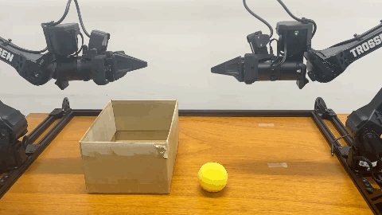

# 11 学習済みVLAを実機へ接続し、動作を評価する

[08 学習・オフライン推論](08_vla_training_inference.md)で確認したcheckpointを、Trossen AI seriesの双腕ロボットへ接続します。まず接続経路を確認し、次に物体を扱うタスクを実行し、失敗した段階を記録します。モデルから数値のactionが出ることと、実機でタスクが成功することを分けて判断できるようになることが、本章の目的です。

標準の起動方法は[Trossen公式の非同期推論](https://docs.trossenrobotics.com/trossen_arm/main/tutorials/lerobot_plugin/async_inference.html)を参照してください。本章は、実際に通した際に必要だった環境の分離、入力の照合、設定の変更、動作の評価を補います。接続先とカメラの個体設定は02で用意したものを引き継ぎます。

> **この章の確認範囲**：LeRobot 0.6.0と固定TrossenプラグインによるSmolVLA・π₀.₅の実機接続、および後述するタスク動作を確認しました。第3・4節のコマンドは、その実行コードを各研究室で設定できる形に整理した起動例です。整理したスクリプトは構文とロボット非接続の設定生成を確認しています。2026年10月8日の再確認では、既存環境を使うSmolVLA・π₀.₅の観測受信・action生成・実機動作まで確認しています。新規環境構築例は再確認していません。推論環境での収録画像検証は第8節の追加診断として分けています。過去の実機実績と、現在の起動例の確認範囲を区別してください。

## 1. ここまでの章とのつながり

| 必要なこと | 参照先 | 本章へ進む条件 |
|---|---|---|
| state・action・episode・VLAの意味 | [00](00_concepts_and_terminology.md) | 数値の指令とタスクの成功が別だと説明できる |
| 駆動・データ形式・モデル・実行系の選択 | [01](01_reference_stack.md)、[07](07_vla_model_selection.md)、[10](10_stack_decisions_and_extension.md) | LeRobot版SmolVLAまたはπ₀.₅を使うと決めている |
| 個体識別、接続、テレオペ、収録 | [02](02_data_collection.md) | 自分の装置で収録でき、使用した収録YAMLを保存している |
| 学習、checkpoint保存、前後処理を含む再読込 | [08](08_vla_training_inference.md) | 自分のcheckpointからオフラインで有限なactionが出る |
| OFTの変換・専用学習経路 | [09](09_openvla_oft_data_bridge.md) | 本章の起動例には接続しない。OFTの実機controllerは未確認 |
| センサ追加と保守 | [03](03_architecture_and_extension.md)、[05](05_maintenance.md) | 既存経路を通した後、変更箇所と再確認範囲を考える |

初心者は00→01→02→07→08→11の順に進めます。03・09・10は研究目的に応じて参照します。収録の正常性は[06](06_validation_results.md)、接続やデバイスの問題は[04](04_troubleshooting.md)へ戻って確認します。

## 2. ロボットを動かす前に準備する

### 2.1 serverとclientを分ける

非同期推論では、**serverがモデルを読み込み、画像・stateからactionを生成**し、**clientがロボットとカメラを扱い、観測を送ってactionを実行**します。モデルは1回の推論で複数時刻のaction（action chunk）をまとめて出し、clientが順番に実行します。実機検証時の実機検証は同じPCの2つのターミナルで行いました。学習PCからネットワーク越しにロボットを動かした例ではありません。

収録用の環境にはTrossenプラグインとカメラの依存、推論用の環境にはモデルとGPUの依存が必要です。GPUに合わせて推論環境を調整しても、動作確認済みの収録環境を一緒に更新しない構成にしました。別PC構成へ変更する場合は、localhostの置換だけでなく通信遅延・切断時の動作も確認します。

実機検証時の実行環境は次のとおりです。必要資源の下限を示す表ではありません。

| 項目 | 実機検証時の値 |
|---|---|
| OS | Ubuntu 24.04.4 LTS |
| 推論GPU | NVIDIA RTX PRO 6000 Blackwell Max-Q Workstation Edition。共有PC上の1台 |
| 推論Python / LeRobot | 3.12.3 / 0.6.0 |
| 推論PyTorch / Transformers | 2.7.1+cu128 / 5.5.4 |
| 非同期追加依存 | grpcio 1.84.0、protobuf 7.36.2 |
| Trossenプラグイン | a4336933f34192a3daa7e9fb52674284bb5ae48e |
| trossen-arm | 1.10.0 |

収録環境の作成は02、学習環境は08を参照します。推論を別環境で行う場合も、公式の非同期推論に従い、serverに`async`とモデルに対応するextra、clientに`async`とロボットプラグインを用意します。SmolVLAのextraは`smolvla`、π₀.₅は`pi`です。本教材の版と揃える場合、LeRobotを0.6.0に固定します。パッケージ一覧の表はlockfileの代わりにはなりません。

実機検証時のGPUでは、収録環境のPyTorchをそのまま使ったGPU計算が通らず、推論環境にCUDA 12.8系buildを用意しました。`torch.cuda.is_available()`がtrueであるだけでは、対象GPUで演算できると判断しません。[PyTorch公式の版別インストール手順](https://pytorch.org/get-started/previous-versions/)でGPU・driverに合うbuildを選び、実際のCUDA演算を確認します。

**実機PCに推論環境を新規作成する場合**は、02で`REPO`を設定した後、収録用の`.venv`と別の場所を使います。次は実機検証で使ったCUDA 12.8 buildを選ぶ場合の組立例です。別のGPU・driverにはbuildの選択をそのまま流用しません。既存環境がある場合は再作成せず、第3・4節でそのPythonを上書き指定します。

```bash
set -euo pipefail
: "${REPO:?02のscripts/session.shをsourceしてください}"
INFER_ENV="$REPO/.venvs/vla-inference"
test ! -e "$INFER_ENV"
uv venv --python 3.12 "$INFER_ENV"
INFER_PY="$INFER_ENV/bin/python"
uv pip install --python "$INFER_PY" \
  'torch==2.7.1' 'torchvision==0.22.1' \
  --index-url https://download.pytorch.org/whl/cu128
printf '%s\n' 'torch==2.7.1+cu128' 'torchvision==0.22.1+cu128' \
  'transformers==5.5.4' > "$INFER_ENV/inference-constraints.txt"
uv pip install --python "$INFER_PY" \
  --constraint "$INFER_ENV/inference-constraints.txt" \
  'lerobot[async,smolvla,pi]==0.6.0'
uv pip check --python "$INFER_PY"
printf '推論Python: %s\n' "$INFER_PY"
```

この例は両モデルのextraを用意し、PyTorchのbuildとTransformersの版を保持します。推移的依存まで固定した環境原本ではなく、整理後の新規構築例です。インストールが通ること、対象GPUの演算、モデルの再読込を順に確認します。収録環境へのasync追加は、その環境の既存版を維持して行います。

### 2.2 checkpointとキャッシュを用意する

08で保存した`pretrained_model`ディレクトリ全体を用意します。`model.safetensors`だけをコピーせず、モデル設定、前処理、後処理、その統計ファイルも含めます。基盤モデル・tokenizerへのアクセス条件は08を参照してください。

| 実機検証で必要だった追加ファイル | 確認したrevision |
|---|---|
| SmolVLA：HuggingFaceTB/SmolVLM2-500M-Video-Instructのキャッシュ | 7b375e1b73b11138ff12fe22c8f2822d8fe03467 |
| π₀.₅：google/paligemma-3b-pt-224のtokenizerキャッシュ | 35e4f46485b4d07967e7e9935bc3786aad50687c |

オフライン実行では、キャッシュも推論側から読める場所に置きます。Hugging Faceのキャッシュを移すときはrefs・snapshots・blobsとsymlinkの参照先を保持します。別環境で取得した認証tokenをキャッシュと一緒に配布しません。

実機検証時のπ₀.₅では、ファイルの転送・ハッシュ照合後も名前による読込に失敗しました。`refs/main`が指すrevision文字列の改行を除いた後、オフライン読込が通りました。ファイルが存在するか、指定したキャッシュを見ているか、参照文字列が正しいかを分けて確認します。

### 2.3 学習入力と実機入力を照合する

| 照合する項目 | 実機検証時の対応 | 合わない場合の対応 |
|---|---|---|
| 画像feature | cam_high、cam_low、cam_left_wrist、cam_right_wristの4視点 | 02の物理対応とcheckpointのinput_featuresを見比べる |
| state/actionの順序 | 左6関節→左gripper→右6関節→右gripper | Datasetのfeature名とロボット側の並びを照合する |
| 単位 | 関節rad、gripper m | 次元数だけで互換と判断せず、保存・読込・指令の単位を確認する |
| action表現 | 実機検証では絶対関節目標。π₀.₅はuse_relative_actions=false | 前後処理を含めて確認し、別表現の重みをそのまま送らない |
| task文 | 収録YAMLのdataset.single_task | 学習時の文を使う。新しい文への汎化は別の評価とする |
| 開始姿勢・画角・物体配置 | おおよそ収録範囲内 | 新配置への汎化と接続確認を一度に評価しない |

14次元のshapeが合っていても、左右・順序・単位は保証されません。また、driverの初期位置と収録開始姿勢は必ずしも一致しません。デモ収録時の開始姿勢と、接続・終了時の姿勢移動を確認します。

通常終了はclient側の`Ctrl+C`です。実機検証時の構成では初期位置へ戻った後に終了するので、復帰が終わりターミナルのプロンプトが表示されるまで待ちます。標準の机・機体配置を前提に、机の上から工具などを片付けて実行します。

## 3. SmolVLAを実機で動かす

以下はUbuntuのbash用です。設定入力・確認・session作成・client実行はターミナルBで行い、server起動だけターミナルAで行います。ターミナル間で変数は自動共有されません。02で設定した`REPO`と`DATASET`を使います。標準構成ならパスを書き換える必要はありません。参照先の確認→GPUと入力設定の確認→試行上限の説明と入力→server/client起動の順に進めます。独自の配置を使う場合の上書き方法は3.1節にまとめています。

### 3.1 モデルとファイルの参照先を確認する

08の第7.2節まで同じPCで進めた場合、学習結果をコピーし直す必要はありません。11は次の場所を直接参照します。`OUTPUTS`を08で変更している場合も、その変数を引き継ぎます。新しいターミナルでは08と同じ`DATASET`・`OUTPUTS`を設定してください。

| 内容 | 標準の参照先 |
|---|---|
| SmolVLA checkpoint | `$OUTPUTS/smolvla_4cam_20k/checkpoints/020000/pretrained_model/` |
| 収録YAML | `$REPO/.runtime/record-$(basename "$DATASET").yaml` |
| client Python | `$REPO/lerobot_trossen/.venv/bin/python` |
| 推論Python | `$REPO/.venvs/vla-inference/bin/python` |
| Hugging Faceキャッシュ | `HF_HUB_CACHE`、または通常の`~/.cache/huggingface/hub`（`HF_HOME`も参照） |

このcheckpointの保存先は、08の第7.2節で`OUT="$OUTPUTS/${POLICY_TYPE}_4cam_20k"`と指定した結果です。LeRobotがすべての学習で自動的にこの名前を付けるわけではありません。第2・3節の短い学習は別の保存先を使います。日付やbatch数を含む独自名で学習した場合は、下の入力でそのcheckpointを参照します。

02のデータ名`aloha_vla_demo`なら、収録YAMLは`record-aloha_vla_demo.yaml`です。このファイルから実機の接続・カメラ設定とtask文を引き継ぎます。別PCで学習した場合は、checkpoint一式と必要なキャッシュを実機PCへ転送し、実機PCで収録に使ったYAMLを指定します。

```bash
export POLICY_TYPE=smolvla
source "$REPO/scripts/policy_session.sh"
```

このコマンドは、**モデル種別と上表の参照先をシェル変数へ設定し、表示するだけ**です。入力待ちにはならず、GPUの選択、動作上限の決定、モデルのロード、実機接続は行いません。08で一時的に使った3-step・200-stepの`CHECKPOINT`変数は引き継がず、20Kの参照先を設定します。

上のコマンドでモデル種別を明示し、そのモデルのcheckpoint参照先を読み込みます。別モデルの試行で使った値をそのまま流用しません。

表示された`Checkpoint`と`Record config`が対象のファイルか確認してください。学習が完了していない、または別名の学習結果を使う場合は、そのまま次へ進まず以下で参照先を指定します。

**既存の学習結果が別名・別の場所にある場合だけ**、次を実行します。`pretrained_model`まで含む絶対パスを入力します。モデル名に対応するローカル設定へ保存するため、次回のsourceでも再利用できます。

入力例（ターミナル表示の例。次のパス自体を実行するものではありません）：

```text
既存のpretrained_modelの絶対パス: /home/student/aloha-vla-reference/outputs/smolvla_4cam_20k/checkpoints/020000/pretrained_model
```

```bash
read -r -p "既存のpretrained_modelの絶対パス: " CHECKPOINT
export CHECKPOINT
test -f "$CHECKPOINT/config.json" &&
mkdir -p "$REPO/.runtime" &&
printf 'export CHECKPOINT=%q\n' "$CHECKPOINT" \
  > "$REPO/.runtime/policy-checkpoint-$POLICY_TYPE.sh"
```

`last/pretrained_model`は最新保存checkpointへの参照です。評価条件を固定するため、本章では`020000/pretrained_model`のようにstepを明示した場所を使います。ファイル名を標準形へ変更したり、学習し直したりする必要はありません。

**別PCで学習したモデルを使う場合、または既存の推論環境を使う場合**は、次の4項目も確認します。転送したファイルと利用する環境が、実機PCのどこにあるかを指定します。標準の参照先を使う項目はEnterだけで現在の値を保持できます。

| 項目 | 入力するもの |
|---|---|
| 収録YAML | 02の収録時に生成した`.runtime/record-<データ名>.yaml`。ロボットの接続とtask文を引き継ぐ |
| 推論Python | モデルを動かす環境の`bin/python`。第2.1節で新規作成済みならその値を保持する |
| client Python | ロボットを操作する環境の`bin/python`。通常は教材内の`lerobot_trossen/.venv/bin/python` |
| モデルキャッシュ | Hugging Faceキャッシュの`hub`ディレクトリ。通常は`~/.cache/huggingface/hub`。独自名のキャッシュでも`models--…`が格納された親ディレクトリを指定する |

例えば収録YAMLと推論環境だけが別の場所にある場合は、次のように入力します。`（Enter）`は入力せず、その行ではEnterキーだけを押します。

```text
収録YAML（Enterで現在値を使用）: /mnt/aloha/aloha-vla-reference/.runtime/record-yellow_ball_box_demo.yaml
推論Python（Enterで現在値を使用）: /mnt/aloha/inference/.venv/bin/python
client Python（Enterで現在値を使用）: （Enter）
モデルキャッシュ（Enterで現在値を使用）: （Enter）
```

```bash
printf '収録YAML: %s\n推論Python: %s\nclient Python: %s\nキャッシュ: %s\n' \
  "$RECORD_CFG" "$INFER_PY" "$CLIENT_PY" "$MODEL_CACHE"
read -r -p "収録YAML（Enterで現在値を使用）: " INPUT_PATH
export RECORD_CFG="${INPUT_PATH:-$RECORD_CFG}"
read -r -p "推論Python（Enterで現在値を使用）: " INPUT_PATH
export INFER_PY="${INPUT_PATH:-$INFER_PY}"
read -r -p "client Python（Enterで現在値を使用）: " INPUT_PATH
export CLIENT_PY="${INPUT_PATH:-$CLIENT_PY}"
read -r -p "モデルキャッシュ（Enterで現在値を使用）: " INPUT_PATH
export MODEL_CACHE="${INPUT_PATH:-$MODEL_CACHE}"
unset INPUT_PATH
```

入力するのはパスの文字列だけです。引用符を付けず、Enterで確定します。`export`は通常、何も表示しません。入力後、次で必要なファイルが存在することを確認します。標準の参照先を使う場合も実行してください。

```bash
if test -f "$RECORD_CFG" && test -f "$CHECKPOINT/config.json" &&
   test -f "$DATASET/meta/info.json" && test -x "$INFER_PY" &&
   test -x "$CLIENT_PY" && test -d "$MODEL_CACHE"; then
  printf '%s\n' 'PATH CHECK: PASS'
else
  printf '%s\n' 'PATH CHECK: FAIL — 表示された参照先と入力を見直してください'
fi
```

**完了条件**：`PATH CHECK: PASS`。FAILならこの節内で参照先を指定し直します。Datasetは3.2節のmetadata照合に使います。実機PCにない場合はディレクトリ全体を転送し、[08冒頭](08_vla_training_inference.md#学習に使うデータの場所を指定する)の入力で`DATASET`を指定します。

独自パスを繰り返し使う場合だけ、次を実行して保存します。標準パスだけなら不要です。既存の`policy-local.sh`は以下の4項目に置き換わります。

```bash
mkdir -p "$REPO/.runtime"
for name in RECORD_CFG INFER_PY CLIENT_PY MODEL_CACHE; do
  printf 'export %s=%q\n' "$name" "${!name}"
done > "$REPO/.runtime/policy-local.sh"
```

次回は`policy_session.sh`をsourceすると読み込まれます。checkpointは先ほどのモデル別ファイルで保持します。モデルごとに別キャッシュを使っている場合は、モデル切替後に参照先確認で`MODEL_CACHE`を指定し直してください。別Datasetの収録YAMLを使う場合も`RECORD_CFG`を指定し直します。ローカル設定はGitへ登録されません。

### 3.2 GPU・依存・入力を確認する（ロボット非接続）

GPUはモデルの計算に使います。まず使用許可のあるGPUを一覧の`index`番号で選びます。選んだ番号からGPU固有のUUIDを取得し、以後の計算先を固定します。ここでは動作上限を入力しません。

例えば使用してよいGPUが一覧のindex 1なら、入力は次のようになります。空きメモリだけで利用許可を判断せず、共有機では利用状況を確認します。

```text
使用するGPU番号（一覧のindex）: 1
Selected GPU: GPU-12345678-1234-1234-1234-123456789abc
```

```bash
nvidia-smi --query-gpu=index,uuid,name,memory.free,utilization.gpu --format=csv
read -r -p "使用するGPU番号（一覧のindex）: " GPU_INDEX
GPU_UUID="$(nvidia-smi -i "$GPU_INDEX" --query-gpu=uuid --format=csv,noheader)" &&
export GPU_UUID
printf 'Selected GPU: %s\n' "$GPU_UUID"
```

UUIDは表示形式の例です。実際には自分のGPUの値が表示されます。番号の指定に失敗した場合は、次へ進まず一覧を確認してください。続けて両環境とGPU演算を確認します。

```bash
uv pip check --python "$INFER_PY"
uv pip check --python "$CLIENT_PY"
CUDA_VISIBLE_DEVICES="${GPU_UUID:?3.2節でGPUを選択してください}" "$INFER_PY" -I - <<'PY'
import torch
import lerobot.async_inference.policy_server
assert torch.cuda.is_available(), "CUDA unavailable"
print("GPU:", torch.cuda.get_device_name(0))
print("CUDA calculation:", torch.ones(1, device="cuda").sum().item())
print("SERVER IMPORT AND CUDA: PASS")
PY
"$CLIENT_PY" -I - <<'PY'
import lerobot.async_inference.robot_client
from lerobot.utils.import_utils import register_third_party_plugins
register_third_party_plugins()
print("CLIENT IMPORT: PASS")
PY
```

`pip check`が通っていても任意のextraが揃っているとは限りません。**`grpcio`不足の場合だけ**、次のブロックでclientの既存版を制約として保存してから`async`を追加します。推論側なら同じ方法で`INFER_PY`を対象にします。制約で失敗した場合は、無制約の更新へ切り替える前に依存差分を調べます。

```bash
mkdir -p "$REPO/.runtime"
"$CLIENT_PY" -I - <<'PY' > "$REPO/.runtime/client-before-constraints.txt"
from importlib.metadata import distributions
for dist in sorted(distributions(), key=lambda d: d.metadata["Name"].lower()):
    print(f'{dist.metadata["Name"]}=={dist.version}')
PY
uv pip install --python "$CLIENT_PY" \
  --constraint "$REPO/.runtime/client-before-constraints.txt" \
  'lerobot[async]==0.6.0'
uv pip check --python "$CLIENT_PY"
```

追加した場合は上のimportを再確認します。

08でcheckpointの再読込と有限な14次元actionの生成を確認した結果を引き継ぎます。別PCで学習した場合も、その結果と転送先checkpointを対応付けます。以下ではDatasetのmetadataとcheckpoint設定を読み、画像feature・14項目の関節順序・action表現を照合します。この確認はGPUもDatasetの動画デコード用ライブラリも使いません。

```bash
"$CLIENT_PY" -I "$REPO/scripts/check_policy_inputs.py" \
  --dataset "$DATASET" --checkpoint "$CHECKPOINT" --policy "$POLICY_TYPE"
cat "$RECORD_CFG"
```

`INPUT METADATA CHECK: PASS`が目安です。標準のTrossenプラグインとは違う名前・順序の外部データでは止まります。14次元という理由だけで名前を変更して通さず、収録・変換時の対応を調べてください。これは設定ファイルの照合であり、モデルの読み込みや実際の画像内容の確認ではありません。

| 表示結果の見る場所 | 確認すること |
|---|---|
| `action_names`と`state_names` | 左6関節→左gripper→右6関節→右gripper。固定プラグインの名前・順序と一致することをスクリプトが確認する |
| `input_features` | 02で対応付けた4視点の画像名と一致すること。Datasetとcheckpoint間の画像名・寸法の一致はスクリプトが確認する |
| π₀.₅のaction表現 | この経路では絶対関節目標。`use_relative_actions=false`をスクリプトが確認する |
| 収録YAMLの`robot.cameras`と左右のIP | 02で実物と対応付けたserial・左右Followerであること。metadataの一致だけでは実物の左右や画角は確認できない |
| 単位 | 関節rad、gripper m。固定Followerで収録したデータの前提。外部データでは取得・変換コードも確認する |
| 収録YAMLの`dataset.single_task` | 学習に使用したデモの指示文と一致すること |

標準の14項目は次の順序です。gripper名の`left`の重複も固定プラグインの名称どおりです。

```text
left_joint_0.pos ～ left_joint_5.pos, left_left_carriage_joint.pos,
right_joint_0.pos ～ right_joint_5.pos, right_left_carriage_joint.pos
```

**完了条件**：08のcheckpoint推論が通り、metadata確認がPASSで、収録YAMLのカメラ・左右・task・単位を照合できること。画像の対応が分からなくなった場合は02の画像確認へ戻ります。実機PCの推論環境で収録画像を使って再確認したい場合は第8節の追加診断を使います。通常の実機起動のために必ず繰り返す手順ではありません。

### 3.3 最初の試行の上限を設定し、実行条件を保存する

ここまでで、実機を動かさずにモデル・入力・GPUを確認しました。次に、**最初の短い実機確認に使う暫定の動作上限**を設定します。タスクを最後まで実行できる最適値を、この段階で確定するわけではありません。

モデルは各関節の目標位置を出力します。`max_relative_target`は、その目標と現在位置の差が大きい場合に、1回の指令で送る目標を現在位置の近くへ切り詰める設定です。例えば現在0 rad、モデルの目標0.2 rad、上限0.05 radなら、制限後の目標は0.05 radになります。

| 入力する変数 | 単位・意味 | この教材で試した値 |
|---|---|---|
| `JOINT_CAP` | 各関節の目標差分上限、rad。0.05 radは約2.9度 | 0.05、0.1 rad |
| `GRIPPER_CAP` | gripperの目標差分上限、m。0.01 mは10 mm | 0.01 m |

これは関節の絶対可動域、gripperの最大開口、速度上限の指定ではありません。指令を繰り返せば移動は積み重なり、接続・終了時の姿勢移動も別にあります。小さければ常に安全、大きければ学習動作を正しく再現する、とも限りません。実機検証では上限が小さい条件ではclampが続いて動作が変わり、0.1 rad条件ではπ₀.₅に激しい動作が見られました。

最初の試行はタスク成功率の測定ではなく、左右の上限が適用され、観測を送って動作が始まり、通常終了できるかを見る短い接続確認にします。物体を扱う前に机の上を片付け、3.5節で表示される上限と動きの向きを確認します。変更が必要なら3.6節で終了してから、第5節に従って一項目ずつ調整します。

SmolVLAの実機検証では、関節0.05 rad・gripper 0.01 mでは把持に成功せず、関節0.1 rad・gripper 0.01 mで投入まで成功した例があります。以下の0.05 radは短い接続確認用の入力例で、成功例と同じ条件ではありません。

次は入力方法の例です。0.05と0.01は実機検証で使用した条件の一つであり、すべての装置へ推奨する安全値ではありません。数字だけを入力し、単位は入力しません。

```text
最初の試行の関節目標差分上限（rad）: 0.05
最初の試行のgripper目標差分上限（m）: 0.01
```

```bash
read -r -p "最初の試行の関節目標差分上限（rad）: " JOINT_CAP
read -r -p "最初の試行のgripper目標差分上限（m）: " GRIPPER_CAP
export JOINT_CAP GRIPPER_CAP
```

選んだ上限と、ここまで確認したファイル・GPU・環境を一つのsessionに保存します。sessionは同じ条件で行う試行のまとまりです。

```bash
bash "$REPO/scripts/start_policy_session.sh" &&
source "$REPO/.runtime/policy-session.sh" &&
"$CLIENT_PY" -I "$SESSION_DIR/robot_policy_client.py" \
  --record "$RECORD_CFG" --checkpoint "$CHECKPOINT" --policy "$POLICY_TYPE" \
  --joint-cap "$JOINT_CAP" --gripper-cap "$GRIPPER_CAP" \
  --output "$SESSION_DIR/config-check"
```

`CLIENT CONFIG: PASS (robot not created or connected)`が目安です。`--execute`を付けないため、ここでもロボットは作成・接続しません。不正な数値やモデル種別の不一致なら、実機起動へ進まず指定を確認します。

入力YAML、スクリプト、package一覧、教材とプラグインのcommitを`outputs/robot_trials/session-…/`へ保存します。以後は保存したYAMLとコードを使います。`config-check/requested_limits.json`は指定値の記録で、実機への適用証明ではありません。適用値は3.5節で確認します。

### 3.4 ターミナルAでserverを起動する

**最初にターミナルBで**次を実行します。作成したSmolVLAのsessionをターミナルAへ渡すためのコマンドが表示されます。

```bash
printf 'cd %q\nsource ./scripts/session.sh\nsource %q\nprintf '\''Policy: %%s\\nSession: %%s\\n'\'' "$POLICY_TYPE" "$SESSION_DIR"\n' \
  "$REPO" "$SESSION_DIR/session.sh"
```

**表示された4行を、ターミナルAへコピーして実行します。** 上の`printf`自体をターミナルAで実行するのではありません。`Policy: smolvla`と、ターミナルBと同じ`Session`のパスが表示されることを確認します。ターミナルAは以前のモデルの設定を保持していることがあるため、モデル切替のたびにこの読込を行います。

ターミナルBはsession作成時の設定を保持したまま使います。別のターミナルBへ移る場合も、表示された4行で同じsessionを読み込んでください。

起動前にターミナルAで以下を実行します。

```bash
ss -ltnp 'sport = :8080'
```

見出し行だけなら待ち受けはありません。プロセスが表示された場合は起動を進めず、そのプロセスを起動したターミナルで終了します。共有PCの不明なプロセスを一括終了しません。同じポートに古いserverが残ると、意図したモデル環境へ接続できないことがあります。

ターミナルAでserverを起動します。保存コードは観測類似判定の`atol=0.01`、localhost:8080、30 Hzを使います。

```bash
bash "$REPO/scripts/run_with_log.sh" "$SESSION_DIR/server.log" env \
  CUDA_VISIBLE_DEVICES="$GPU_UUID" HF_HUB_CACHE="$MODEL_CACHE" \
  HF_HUB_OFFLINE=1 TRANSFORMERS_OFFLINE=1 HF_HUB_DISABLE_IMPLICIT_TOKEN=1 \
  PYTHONUNBUFFERED=1 \
  "$INFER_PY" -I "$SESSION_DIR/robot_policy_server.py"
```

`PolicyServer started on 127.0.0.1:8080`の後に表示が止まるのはclient待機です。checkpointはclientから指定され、初回接続でロードされます。起動表示だけでモデルロード完了と判断しません。

### 3.5 ターミナルBでclientを起動する（実機が動く）

設定したターミナルBへ戻ります。次の表示が`smolvla`で、ターミナルAと同じsessionか確認してから起動します。他のteleop・record・clientを終了し、机の上の工具などを片付けてから実行します。

```bash
printf 'Policy: %s\nSession: %s\n' "$POLICY_TYPE" "$SESSION_DIR"
```

モデル・sessionが違う場合は起動せず、3.4節で生成した読込コマンドを実行します。

```bash
RUN=$(mktemp -d "$SESSION_DIR/trial-XXXXXXXX")
printf 'Trial directory: %s\n' "$RUN"
bash "$REPO/scripts/run_with_log.sh" "$RUN/client.log" env PYTHONUNBUFFERED=1 \
  "$CLIENT_PY" -I "$SESSION_DIR/robot_policy_client.py" \
  --record "$RECORD_CFG" --checkpoint "$CHECKPOINT" --policy "$POLICY_TYPE" \
  --joint-cap "$JOINT_CAP" --gripper-cap "$GRIPPER_CAP" \
  --output "$RUN/client" --execute
```

左右の`limits`表示と`client/effective_limits.json`を確認します。factoryで構成した各armへ関節別dictを設定してから接続します。保存`client.yaml`のscalarは生成時の値であり、**実行時の上限はdictの方**です。固定版と双腕WidowX AI向けなので、別のrobot・LeRobot版では構成と接続の順序を確認します。

初回ロードには待ち時間があります。最初の試行では、次の順でターミナル表示と動作を見ます。

1. clientに左右の`limits`が表示され、`effective_limits.json`の各`joint_0`〜`joint_5`が入力した`JOINT_CAP`、carriage jointが`GRIPPER_CAP`になっていることを確認する。実効設定が違う場合はタスク試行へ進まず、実行したsessionを見直す。
2. serverでモデルロードが進み、その後clientが観測を送ってactionを受け取るログが続くことを確認する。起動表示だけで止まる場合は第5.2節で待機・ロード・障害を切り分ける。
3. 短い動作を見たら3.6節で終了し、初期位置へ戻ってターミナルのプロンプトが表示されること、trialの`client.log`が残ることを確認する。これは接続・通常終了の確認で、タスク成功の判定ではない。
4. 上記が通った後、デモ収録時と同じ物体・画角・開始配置へ戻してタスクを試す。把持・輸送・受け渡し・投入のどこまで進んだか、停止や介入があったかを第6節の方法で記録する。

**短い接続確認の完了条件**：実効上限が指定値と一致し、観測送信・推論・動作・通常終了とログ保存を確認できること。途中で不一致や不安定動作があれば、結果を残して第5節へ戻ります。

### 3.6 終了して次の試行を残す

ターミナルBでCtrl+Cし、アームが初期位置へ戻り、ターミナルのプロンプトが表示されるまで待ちます。serverも終了する場合は、その後にターミナルAでCtrl+Cします。

通常終了後、ターミナルBで実効上限とログを確認し、試行結果を残します。起動エラーで終了した場合は、通常終了とせずエラー内容を記録します。実効上限ファイルが未生成なら、その確認を飛ばして残っているログを読みます。

```bash
cat "$RUN/client/effective_limits.json"
tail -n 30 "$RUN/client.log"
read -r -p "タスク結果と終了時の挙動: " TRIAL_NOTE
printf '%s\t%s\n' "$RUN" "$TRIAL_NOTE" >> "$SESSION_DIR/trial_notes.txt"
```

入力例：`把持できずタスク不成功。Ctrl+C後は初期位置へ戻り、プロンプトが表示された。` 接続確認だけを行った場合は、`短い接続確認のみ。タスク成否は評価せず。初期位置へ戻り終了。`のように記録します。タスク成否と終了の成否を「失敗」の一語でまとめません。

Ctrl+Cによる終了では終了コードが130などになる場合があります。コード0だけを通常終了の条件にせず、初期位置への復帰とプロンプトへの復帰を確認します。ログに終了時刻が残らなかった場合も、その旨を試行メモへ記録します。

同じモデル・条件なら開始条件を戻し、3.5節を繰り返します。試行ごとに別の保存先ができます。上限だけを変更する場合は両プロセスを終了し、3.3節で新しい値を入力して新sessionを作ります。同じモデルでパス・コードを変える場合は、3.1節から対応する設定と確認をやり直します。ログの上書きを拒否するため、同じserverを再起動する場合も新しいsessionを作ってください。

## 4. π₀.₅を実機で動かす

SmolVLAから切り替える場合は、次の表で再実行する作業を確認してから、4.1から順に進めます。π₀.₅だけを使う場合も4.1から開始できます。

| 作業 | SmolVLAから切り替えるとき |
|---|---|
| PC・ロボットのセットアップ、収録、学習 | やり直さない。学習済みのπ₀.₅ checkpointを用意する |
| 第2.1節の推論環境作成 | π₀.₅を実行できる既存環境ならやり直さない |
| SmolVLAのclientとserver | clientをCtrl+Cで終了し、初期位置への復帰後にserverも終了する |
| checkpoint・キャッシュの指定 | π₀.₅用へ変更する。Python・収録YAML・Datasetは同じものなら保持する |
| GPU・依存・入力設定確認 | 4.2で確認する。同じGPUを使う場合も番号を選び直せる |
| 関節・gripper上限、session作成 | 4.3で入力し直し、π₀.₅用の新しいsessionを作る |
| ターミナルA・Bの設定読込、server・client起動 | 4.4・4.5で新しいsessionを読み込み、両方を起動し直す |

SmolVLAのsessionを読み込むとモデル設定もSmolVLAへ戻ります。以下で新しいsessionを作るまでは、古い`.runtime/policy-session.sh`をsourceし直しません。

以下はUbuntuのbash用です。設定入力・確認・session作成・client実行はターミナルBで行い、server起動だけターミナルAで行います。ターミナル間で変数は自動共有されません。02で設定した`REPO`と`DATASET`を使います。標準構成ならパスを書き換える必要はありません。参照先の確認→GPUと入力設定の確認→試行上限の説明と入力→server/client起動の順に進めます。独自の配置を使う場合の上書き方法は4.1節にまとめています。

### 4.1 モデルとファイルの参照先を確認する

08の第7.2節まで同じPCで進めた場合、学習結果をコピーし直す必要はありません。11は次の場所を直接参照します。`OUTPUTS`を08で変更している場合も、その変数を引き継ぎます。新しいターミナルでは08と同じ`DATASET`・`OUTPUTS`を設定してください。

| 内容 | 標準の参照先 |
|---|---|
| π₀.₅ checkpoint | `$OUTPUTS/pi05_4cam_20k/checkpoints/020000/pretrained_model/` |
| 収録YAML | `$REPO/.runtime/record-$(basename "$DATASET").yaml` |
| client Python | `$REPO/lerobot_trossen/.venv/bin/python` |
| 推論Python | `$REPO/.venvs/vla-inference/bin/python` |
| Hugging Faceキャッシュ | `HF_HUB_CACHE`、または通常の`~/.cache/huggingface/hub`（`HF_HOME`も参照） |

このcheckpointの保存先は、08の第7.2節で`OUT="$OUTPUTS/${POLICY_TYPE}_4cam_20k"`と指定した結果です。LeRobotがすべての学習で自動的にこの名前を付けるわけではありません。第2・3節の短い学習は別の保存先を使います。日付やbatch数を含む独自名で学習した場合は、下の入力でそのcheckpointを参照します。

02のデータ名`aloha_vla_demo`なら、収録YAMLは`record-aloha_vla_demo.yaml`です。このファイルから実機の接続・カメラ設定とtask文を引き継ぎます。別PCで学習した場合は、checkpoint一式と必要なキャッシュを実機PCへ転送し、実機PCで収録に使ったYAMLを指定します。

```bash
export POLICY_TYPE=pi05
source "$REPO/scripts/policy_session.sh"
```

このコマンドは、**モデル種別と上表の参照先をシェル変数へ設定し、表示するだけ**です。入力待ちにはならず、GPUの選択、動作上限の決定、モデルのロード、実機接続は行いません。08で一時的に使った3-step・200-stepの`CHECKPOINT`変数は引き継がず、20Kの参照先を設定します。

上のコマンドでモデル種別を明示し、そのモデルのcheckpoint参照先を読み込みます。別モデルの試行で使った値をそのまま流用しません。

表示された`Checkpoint`と`Record config`が対象のファイルか確認してください。学習が完了していない、または別名の学習結果を使う場合は、そのまま次へ進まず以下で参照先を指定します。

**既存の学習結果が別名・別の場所にある場合だけ**、次を実行します。`pretrained_model`まで含む絶対パスを入力します。モデル名に対応するローカル設定へ保存するため、次回のsourceでも再利用できます。

入力例（ターミナル表示の例。次のパス自体を実行するものではありません）：

```text
既存のpretrained_modelの絶対パス: /home/student/aloha-vla-reference/outputs/pi05_4cam_b8_20k_20261005_190207/checkpoints/020000/pretrained_model
```

```bash
read -r -p "既存のpretrained_modelの絶対パス: " CHECKPOINT
export CHECKPOINT
test -f "$CHECKPOINT/config.json" &&
mkdir -p "$REPO/.runtime" &&
printf 'export CHECKPOINT=%q\n' "$CHECKPOINT" \
  > "$REPO/.runtime/policy-checkpoint-$POLICY_TYPE.sh"
```

`last/pretrained_model`は最新保存checkpointへの参照です。評価条件を固定するため、本章では`020000/pretrained_model`のようにstepを明示した場所を使います。ファイル名を標準形へ変更したり、学習し直したりする必要はありません。

**別PCで学習したモデルを使う場合、または既存の推論環境を使う場合**は、次の4項目も確認します。転送したファイルと利用する環境が、実機PCのどこにあるかを指定します。標準の参照先を使う項目はEnterだけで現在の値を保持できます。

| 項目 | 入力するもの |
|---|---|
| 収録YAML | 02の収録時に生成した`.runtime/record-<データ名>.yaml`。ロボットの接続とtask文を引き継ぐ |
| 推論Python | モデルを動かす環境の`bin/python`。第2.1節で新規作成済みならその値を保持する |
| client Python | ロボットを操作する環境の`bin/python`。通常は教材内の`lerobot_trossen/.venv/bin/python` |
| モデルキャッシュ | Hugging Faceキャッシュの`hub`ディレクトリ。通常は`~/.cache/huggingface/hub`。独自名のキャッシュでも`models--…`が格納された親ディレクトリを指定する |

例えば収録YAMLと推論環境だけが別の場所にある場合は、次のように入力します。`（Enter）`は入力せず、その行ではEnterキーだけを押します。

```text
収録YAML（Enterで現在値を使用）: /mnt/aloha/aloha-vla-reference/.runtime/record-yellow_ball_box_demo.yaml
推論Python（Enterで現在値を使用）: /mnt/aloha/inference/.venv/bin/python
client Python（Enterで現在値を使用）: （Enter）
モデルキャッシュ（Enterで現在値を使用）: （Enter）
```

```bash
printf '収録YAML: %s\n推論Python: %s\nclient Python: %s\nキャッシュ: %s\n' \
  "$RECORD_CFG" "$INFER_PY" "$CLIENT_PY" "$MODEL_CACHE"
read -r -p "収録YAML（Enterで現在値を使用）: " INPUT_PATH
export RECORD_CFG="${INPUT_PATH:-$RECORD_CFG}"
read -r -p "推論Python（Enterで現在値を使用）: " INPUT_PATH
export INFER_PY="${INPUT_PATH:-$INFER_PY}"
read -r -p "client Python（Enterで現在値を使用）: " INPUT_PATH
export CLIENT_PY="${INPUT_PATH:-$CLIENT_PY}"
read -r -p "モデルキャッシュ（Enterで現在値を使用）: " INPUT_PATH
export MODEL_CACHE="${INPUT_PATH:-$MODEL_CACHE}"
unset INPUT_PATH
```

入力するのはパスの文字列だけです。引用符を付けず、Enterで確定します。`export`は通常、何も表示しません。入力後、次で必要なファイルが存在することを確認します。標準の参照先を使う場合も実行してください。

```bash
if test -f "$RECORD_CFG" && test -f "$CHECKPOINT/config.json" &&
   test -f "$DATASET/meta/info.json" && test -x "$INFER_PY" &&
   test -x "$CLIENT_PY" && test -d "$MODEL_CACHE"; then
  printf '%s\n' 'PATH CHECK: PASS'
else
  printf '%s\n' 'PATH CHECK: FAIL — 表示された参照先と入力を見直してください'
fi
```

**完了条件**：`PATH CHECK: PASS`。FAILならこの節内で参照先を指定し直します。Datasetは4.2節のmetadata照合に使います。実機PCにない場合はディレクトリ全体を転送し、[08冒頭](08_vla_training_inference.md#学習に使うデータの場所を指定する)の入力で`DATASET`を指定します。

独自パスを繰り返し使う場合だけ、次を実行して保存します。標準パスだけなら不要です。既存の`policy-local.sh`は以下の4項目に置き換わります。

```bash
mkdir -p "$REPO/.runtime"
for name in RECORD_CFG INFER_PY CLIENT_PY MODEL_CACHE; do
  printf 'export %s=%q\n' "$name" "${!name}"
done > "$REPO/.runtime/policy-local.sh"
```

次回は`policy_session.sh`をsourceすると読み込まれます。checkpointは先ほどのモデル別ファイルで保持します。モデルごとに別キャッシュを使っている場合は、モデル切替後に参照先確認で`MODEL_CACHE`を指定し直してください。別Datasetの収録YAMLを使う場合も`RECORD_CFG`を指定し直します。ローカル設定はGitへ登録されません。

### 4.2 GPU・依存・入力を確認する（ロボット非接続）

GPUはモデルの計算に使います。まず使用許可のあるGPUを一覧の`index`番号で選びます。選んだ番号からGPU固有のUUIDを取得し、以後の計算先を固定します。ここでは動作上限を入力しません。

例えば使用してよいGPUが一覧のindex 1なら、入力は次のようになります。空きメモリだけで利用許可を判断せず、共有機では利用状況を確認します。

```text
使用するGPU番号（一覧のindex）: 1
Selected GPU: GPU-12345678-1234-1234-1234-123456789abc
```

```bash
nvidia-smi --query-gpu=index,uuid,name,memory.free,utilization.gpu --format=csv
read -r -p "使用するGPU番号（一覧のindex）: " GPU_INDEX
GPU_UUID="$(nvidia-smi -i "$GPU_INDEX" --query-gpu=uuid --format=csv,noheader)" &&
export GPU_UUID
printf 'Selected GPU: %s\n' "$GPU_UUID"
```

UUIDは表示形式の例です。実際には自分のGPUの値が表示されます。番号の指定に失敗した場合は、次へ進まず一覧を確認してください。続けて両環境とGPU演算を確認します。

```bash
uv pip check --python "$INFER_PY"
uv pip check --python "$CLIENT_PY"
CUDA_VISIBLE_DEVICES="${GPU_UUID:?4.2節でGPUを選択してください}" "$INFER_PY" -I - <<'PY'
import torch
import lerobot.async_inference.policy_server
assert torch.cuda.is_available(), "CUDA unavailable"
print("GPU:", torch.cuda.get_device_name(0))
print("CUDA calculation:", torch.ones(1, device="cuda").sum().item())
print("SERVER IMPORT AND CUDA: PASS")
PY
"$CLIENT_PY" -I - <<'PY'
import lerobot.async_inference.robot_client
from lerobot.utils.import_utils import register_third_party_plugins
register_third_party_plugins()
print("CLIENT IMPORT: PASS")
PY
```

`pip check`が通っていても任意のextraが揃っているとは限りません。**`grpcio`不足の場合だけ**、次のブロックでclientの既存版を制約として保存してから`async`を追加します。推論側なら同じ方法で`INFER_PY`を対象にします。制約で失敗した場合は、無制約の更新へ切り替える前に依存差分を調べます。

```bash
mkdir -p "$REPO/.runtime"
"$CLIENT_PY" -I - <<'PY' > "$REPO/.runtime/client-before-constraints.txt"
from importlib.metadata import distributions
for dist in sorted(distributions(), key=lambda d: d.metadata["Name"].lower()):
    print(f'{dist.metadata["Name"]}=={dist.version}')
PY
uv pip install --python "$CLIENT_PY" \
  --constraint "$REPO/.runtime/client-before-constraints.txt" \
  'lerobot[async]==0.6.0'
uv pip check --python "$CLIENT_PY"
```

追加した場合は上のimportを再確認します。

08でcheckpointの再読込と有限な14次元actionの生成を確認した結果を引き継ぎます。別PCで学習した場合も、その結果と転送先checkpointを対応付けます。以下ではDatasetのmetadataとcheckpoint設定を読み、画像feature・14項目の関節順序・action表現を照合します。この確認はGPUもDatasetの動画デコード用ライブラリも使いません。

```bash
"$CLIENT_PY" -I "$REPO/scripts/check_policy_inputs.py" \
  --dataset "$DATASET" --checkpoint "$CHECKPOINT" --policy "$POLICY_TYPE"
cat "$RECORD_CFG"
```

`INPUT METADATA CHECK: PASS`が目安です。標準のTrossenプラグインとは違う名前・順序の外部データでは止まります。14次元という理由だけで名前を変更して通さず、収録・変換時の対応を調べてください。これは設定ファイルの照合であり、モデルの読み込みや実際の画像内容の確認ではありません。

| 表示結果の見る場所 | 確認すること |
|---|---|
| `action_names`と`state_names` | 左6関節→左gripper→右6関節→右gripper。固定プラグインの名前・順序と一致することをスクリプトが確認する |
| `input_features` | 02で対応付けた4視点の画像名と一致すること。Datasetとcheckpoint間の画像名・寸法の一致はスクリプトが確認する |
| π₀.₅のaction表現 | この経路では絶対関節目標。`use_relative_actions=false`をスクリプトが確認する |
| 収録YAMLの`robot.cameras`と左右のIP | 02で実物と対応付けたserial・左右Followerであること。metadataの一致だけでは実物の左右や画角は確認できない |
| 単位 | 関節rad、gripper m。固定Followerで収録したデータの前提。外部データでは取得・変換コードも確認する |
| 収録YAMLの`dataset.single_task` | 学習に使用したデモの指示文と一致すること |

標準の14項目は次の順序です。gripper名の`left`の重複も固定プラグインの名称どおりです。

```text
left_joint_0.pos ～ left_joint_5.pos, left_left_carriage_joint.pos,
right_joint_0.pos ～ right_joint_5.pos, right_left_carriage_joint.pos
```

**完了条件**：08のcheckpoint推論が通り、metadata確認がPASSで、収録YAMLのカメラ・左右・task・単位を照合できること。画像の対応が分からなくなった場合は02の画像確認へ戻ります。実機PCの推論環境で収録画像を使って再確認したい場合は第8節の追加診断を使います。通常の実機起動のために必ず繰り返す手順ではありません。

### 4.3 最初の試行の上限を設定し、実行条件を保存する

ここまでで、実機を動かさずにモデル・入力・GPUを確認しました。次に、**最初の短い実機確認に使う暫定の動作上限**を設定します。タスクを最後まで実行できる最適値を、この段階で確定するわけではありません。

モデルは各関節の目標位置を出力します。`max_relative_target`は、その目標と現在位置の差が大きい場合に、1回の指令で送る目標を現在位置の近くへ切り詰める設定です。例えば現在0 rad、モデルの目標0.2 rad、上限0.05 radなら、制限後の目標は0.05 radになります。

| 入力する変数 | 単位・意味 | この教材で試した値 |
|---|---|---|
| `JOINT_CAP` | 各関節の目標差分上限、rad。0.05 radは約2.9度 | 0.05、0.1 rad |
| `GRIPPER_CAP` | gripperの目標差分上限、m。0.01 mは10 mm | 0.01 m |

これは関節の絶対可動域、gripperの最大開口、速度上限の指定ではありません。指令を繰り返せば移動は積み重なり、接続・終了時の姿勢移動も別にあります。小さければ常に安全、大きければ学習動作を正しく再現する、とも限りません。実機検証では上限が小さい条件ではclampが続いて動作が変わり、0.1 rad条件ではπ₀.₅に激しい動作が見られました。

最初の試行はタスク成功率の測定ではなく、左右の上限が適用され、観測を送って動作が始まり、通常終了できるかを見る短い接続確認にします。物体を扱う前に机の上を片付け、4.5節で表示される上限と動きの向きを確認します。変更が必要なら4.6節で終了してから、第5節に従って一項目ずつ調整します。

π₀.₅の実機検証では、関節0.1 rad条件で激しい動作が見られました。SmolVLAの成功条件をそのまま採用せず、短い接続確認から進めます。

次は入力方法の例です。0.05と0.01は実機検証で使用した条件の一つであり、すべての装置へ推奨する安全値ではありません。数字だけを入力し、単位は入力しません。

```text
最初の試行の関節目標差分上限（rad）: 0.05
最初の試行のgripper目標差分上限（m）: 0.01
```

```bash
read -r -p "最初の試行の関節目標差分上限（rad）: " JOINT_CAP
read -r -p "最初の試行のgripper目標差分上限（m）: " GRIPPER_CAP
export JOINT_CAP GRIPPER_CAP
```

選んだ上限と、ここまで確認したファイル・GPU・環境を一つのsessionに保存します。sessionは同じ条件で行う試行のまとまりです。

```bash
bash "$REPO/scripts/start_policy_session.sh" &&
source "$REPO/.runtime/policy-session.sh" &&
"$CLIENT_PY" -I "$SESSION_DIR/robot_policy_client.py" \
  --record "$RECORD_CFG" --checkpoint "$CHECKPOINT" --policy "$POLICY_TYPE" \
  --joint-cap "$JOINT_CAP" --gripper-cap "$GRIPPER_CAP" \
  --output "$SESSION_DIR/config-check"
```

`CLIENT CONFIG: PASS (robot not created or connected)`が目安です。`--execute`を付けないため、ここでもロボットは作成・接続しません。不正な数値やモデル種別の不一致なら、実機起動へ進まず指定を確認します。

入力YAML、スクリプト、package一覧、教材とプラグインのcommitを`outputs/robot_trials/session-…/`へ保存します。以後は保存したYAMLとコードを使います。`config-check/requested_limits.json`は指定値の記録で、実機への適用証明ではありません。適用値は4.5節で確認します。

### 4.4 ターミナルAでserverを起動する

**最初にターミナルBで**次を実行します。作成したπ₀.₅のsessionをターミナルAへ渡すためのコマンドが表示されます。

```bash
printf 'cd %q\nsource ./scripts/session.sh\nsource %q\nprintf '\''Policy: %%s\\nSession: %%s\\n'\'' "$POLICY_TYPE" "$SESSION_DIR"\n' \
  "$REPO" "$SESSION_DIR/session.sh"
```

**表示された4行を、ターミナルAへコピーして実行します。** 上の`printf`自体をターミナルAで実行するのではありません。`Policy: pi05`と、ターミナルBと同じ`Session`のパスが表示されることを確認します。ターミナルAは以前のモデルの設定を保持していることがあるため、モデル切替のたびにこの読込を行います。

ターミナルBはsession作成時の設定を保持したまま使います。別のターミナルBへ移る場合も、表示された4行で同じsessionを読み込んでください。

起動前にターミナルAで以下を実行します。

```bash
ss -ltnp 'sport = :8080'
```

見出し行だけなら待ち受けはありません。プロセスが表示された場合は起動を進めず、そのプロセスを起動したターミナルで終了します。共有PCの不明なプロセスを一括終了しません。同じポートに古いserverが残ると、意図したモデル環境へ接続できないことがあります。

ターミナルAでserverを起動します。保存コードは観測類似判定の`atol=0.01`、localhost:8080、30 Hzを使います。

```bash
bash "$REPO/scripts/run_with_log.sh" "$SESSION_DIR/server.log" env \
  CUDA_VISIBLE_DEVICES="$GPU_UUID" HF_HUB_CACHE="$MODEL_CACHE" \
  HF_HUB_OFFLINE=1 TRANSFORMERS_OFFLINE=1 HF_HUB_DISABLE_IMPLICIT_TOKEN=1 \
  PYTHONUNBUFFERED=1 \
  "$INFER_PY" -I "$SESSION_DIR/robot_policy_server.py"
```

`PolicyServer started on 127.0.0.1:8080`の後に表示が止まるのはclient待機です。checkpointはclientから指定され、初回接続でロードされます。起動表示だけでモデルロード完了と判断しません。

### 4.5 ターミナルBでclientを起動する（実機が動く）

設定したターミナルBへ戻ります。次の表示が`pi05`で、ターミナルAと同じsessionか確認してから起動します。他のteleop・record・clientを終了し、机の上の工具などを片付けてから実行します。

```bash
printf 'Policy: %s\nSession: %s\n' "$POLICY_TYPE" "$SESSION_DIR"
```

モデル・sessionが違う場合は起動せず、4.4節で生成した読込コマンドを実行します。

```bash
RUN=$(mktemp -d "$SESSION_DIR/trial-XXXXXXXX")
printf 'Trial directory: %s\n' "$RUN"
bash "$REPO/scripts/run_with_log.sh" "$RUN/client.log" env PYTHONUNBUFFERED=1 \
  "$CLIENT_PY" -I "$SESSION_DIR/robot_policy_client.py" \
  --record "$RECORD_CFG" --checkpoint "$CHECKPOINT" --policy "$POLICY_TYPE" \
  --joint-cap "$JOINT_CAP" --gripper-cap "$GRIPPER_CAP" \
  --output "$RUN/client" --execute
```

左右の`limits`表示と`client/effective_limits.json`を確認します。factoryで構成した各armへ関節別dictを設定してから接続します。保存`client.yaml`のscalarは生成時の値であり、**実行時の上限はdictの方**です。固定版と双腕WidowX AI向けなので、別のrobot・LeRobot版では構成と接続の順序を確認します。

初回ロードには待ち時間があります。最初の試行では、次の順でターミナル表示と動作を見ます。

1. clientに左右の`limits`が表示され、`effective_limits.json`の各`joint_0`〜`joint_5`が入力した`JOINT_CAP`、carriage jointが`GRIPPER_CAP`になっていることを確認する。実効設定が違う場合はタスク試行へ進まず、実行したsessionを見直す。
2. serverでモデルロードが進み、その後clientが観測を送ってactionを受け取るログが続くことを確認する。起動表示だけで止まる場合は第5.2節で待機・ロード・障害を切り分ける。
3. 短い動作を見たら4.6節で終了し、初期位置へ戻ってターミナルのプロンプトが表示されること、trialの`client.log`が残ることを確認する。これは接続・通常終了の確認で、タスク成功の判定ではない。
4. 上記が通った後、デモ収録時と同じ物体・画角・開始配置へ戻してタスクを試す。把持・輸送・受け渡し・投入のどこまで進んだか、停止や介入があったかを第6節の方法で記録する。

**短い接続確認の完了条件**：実効上限が指定値と一致し、観測送信・推論・動作・通常終了とログ保存を確認できること。途中で不一致や不安定動作があれば、結果を残して第5節へ戻ります。

### 4.6 終了して次の試行を残す

ターミナルBでCtrl+Cし、アームが初期位置へ戻り、ターミナルのプロンプトが表示されるまで待ちます。serverも終了する場合は、その後にターミナルAでCtrl+Cします。

通常終了後、ターミナルBで実効上限とログを確認し、試行結果を残します。起動エラーで終了した場合は、通常終了とせずエラー内容を記録します。実効上限ファイルが未生成なら、その確認を飛ばして残っているログを読みます。

```bash
cat "$RUN/client/effective_limits.json"
tail -n 30 "$RUN/client.log"
read -r -p "タスク結果と終了時の挙動: " TRIAL_NOTE
printf '%s\t%s\n' "$RUN" "$TRIAL_NOTE" >> "$SESSION_DIR/trial_notes.txt"
```

入力例：`把持できずタスク不成功。Ctrl+C後は初期位置へ戻り、プロンプトが表示された。` 接続確認だけを行った場合は、`短い接続確認のみ。タスク成否は評価せず。初期位置へ戻り終了。`のように記録します。タスク成否と終了の成否を「失敗」の一語でまとめません。

Ctrl+Cによる終了では終了コードが130などになる場合があります。コード0だけを通常終了の条件にせず、初期位置への復帰とプロンプトへの復帰を確認します。ログに終了時刻が残らなかった場合も、その旨を試行メモへ記録します。

同じモデル・条件なら開始条件を戻し、4.5節を繰り返します。試行ごとに別の保存先ができます。上限だけを変更する場合は両プロセスを終了し、4.3節で新しい値を入力して新sessionを作ります。同じモデルでパス・コードを変える場合は、4.1節から対応する設定と確認をやり直します。ログの上書きを拒否するため、同じserverを再起動する場合も新しいsessionを作ってください。

## 5. 同じ場所を繰り返すときの診断

### 5.1 三つの設定を混同しない

| 設定 | 何を変えるか | 実機検証時の値と注意点 |
|---|---|---|
| serverのobservations_similarのatol | stateに基づく観測の類似判定。画像の類似ではない | 既定値1から0.01へ変更。単位の混在するstateに対する実装の閾値で、関節別の安全値ではない |
| max_relative_target | 現在位置と目標位置の差を切り詰める | SmolVLAの成功例は関節0.1 rad、gripper0.01 m。π₀.₅では同じ関節上限で不安定動作あり。速度・絶対可動範囲・衝突回避とは別 |
| relative actionの前後処理 | モデルが学習・予測するactionの表現 | 実機検証時のπ₀.₅は無効。上の制限を変えてもaction表現は変わらない |

実機検証時の非同期設定は30 Hz、50 actions/chunk、chunk_size_threshold 0.5、weighted_averageでした。ロボット設定にはmin_time_to_move_multiplier 3.0、loop_rate 30を使いました。第3・4節はこれらのロボット設定を収録YAMLから引き継ぐため、YAMLの内容も確認します。設定30 Hzは、全試行で30 Hzを実測保証したという意味ではありません。

### 5.2 症状から、確認する層を絞る

| 症状 | 先に確認するもの | 実機検証で得られた対処・判断 |
|---|---|---|
| async moduleのimportでgrpcio不足 | server/client双方のextra | 通常の依存整合性チェックはPASSでもasyncは不足。既存版を保ちながら追加して双方のimportを確認 |
| CUDA検出は通るが演算できない | GPUとPyTorch build | 収録環境を保ち、対象GPUでCUDA演算が通る推論環境を別に用意 |
| オフライン読込でファイルが見つからない | checkpoint一式、キャッシュ指定、refsと参照先 | tokenizer転送のハッシュが通っても参照が不正なら読めない。実際のロードまで確認 |
| `Log already exists`で起動が止まる | 表示されたログパスと両ターミナルのsession | 別モデルのsessionなら設定を読み直す。同じsessionのserver.logが存在する場合は新sessionを作る。過去ログは削除しない |
| clientが接続しても新serverに接続ログが出ない | `ss -ltnp 'sport = :8080'`の待ち受け | 古いserverと新serverが同じポートで待ち受けていた実例あり。自分が起動した旧serverを終了して再接続 |
| 収録画像検証で`pyarrow`等がない | 実行したPythonとDataset依存 | client用環境に依存があっても推論用環境には共有されない。GPU/serverの確認と画像検証の成否を分ける |
| serverの起動表示から進まない | clientを起動したか、初回ロード中か | serverの待機と障害を区別。起動時点ではモデル未ロードの場合がある |
| 接近後に上下動を繰り返す、clamp警告が続く | 予測目標とclamp後の指令、実行時の上限 | 小さなscalar制限が動作を変えていた可能性。関節とgripperを分けて記録・調整 |
| 奥行きがずれる、片指だけ触れる | 画角、開始姿勢、物体配置、収録範囲 | 画像を使っていないとは即断しない。収録範囲内で接触位置を確認 |
| 持ち上げ・輸送中に落とす | 把持の深さ、物体・箱との接触、閉じるタイミング | 輸送中落下と受け渡し失敗を分ける。実機検証時の端を掴むデモは原因候補であり確定原因ではない |
| 大きく振れる、動作が不安定になる | 適用条件、入力画像、左右の対応と実効上限 | 試行を終了して記録する。上限を拡大し続けて解決しようとしない |

調整が必要なら、まず失敗した試行を終了し、上の表から症状に合う一行を選びます。画像・配置の違いならデモの条件へ戻し、実効上限の違いならsessionの指定を直します。clamp警告が続く場合は`prediction`と現在位置、適用された上限を見比べ、制限が動作を変えている可能性を検討します。警告があるという理由だけで0.05から0.1へ引き上げる手順にはしません。実機検証時の値は比較例として扱います。

診断では一つずつ条件を変え、変更前後の設定と結果を対にして残します。実機検証時の調整は、物体配置・乱数・GPU負荷を固定した対照実験ではありません。観測類似判定の変更だけ、または制限の変更だけが改善原因だったとは確定していません。

### 5.3 調整する場所と再確認する範囲

| 変更したいもの | 編集する場所 | 次に確認すること |
|---|---|---|
| GPU | 各モデルのGPU・入力確認のGPU番号入力 | 選択GPUでCUDA演算とモデル再読込を確認 |
| 関節・gripperの目標差分上限 | 各モデルの上限設定の`JOINT_CAP`、`GRIPPER_CAP`入力 | 新しいsessionで左右のlimits表示と短い動作を確認 |
| 独自の環境・checkpoint・キャッシュ | 各モデルの参照先確認の上書き指定。checkpointはモデル別設定ファイル、その他は`.runtime/policy-local.sh`にも保存可能 | GPU演算と入力設定を照合し、server起動後に対象モデルのロードを確認 |
| カメラ・接続先・loop_rate・move multiplier | 対象の収録YAML、または02のローカル設定から生成し直したYAML | まず02の接続・画像確認。収録と推論で対応が変わっていないか |
| 観測類似判定のatol | `scripts/robot_policy_server.py` | 新しいsessionにコードを保存し、状態変化に対する推論の更新を確認 |
| chunk長・threshold・aggregation・fps | `scripts/robot_policy_client.py`のconfig生成部。fpsはserver側も照合 | モデルのchunk設定、消費速度、queueと動作。30 Hzという指定だけで実効周期を保証しない |

元ファイルを変更したら各モデルのGPU・入力確認で影響する部分を確認し、各モデルの上限設定で新しいsessionを作ります。古いsession内のコピーを編集して過去の条件を書き換えないでください。`client.yaml`のscalarだけを変更しても、起動コードが関節別dictで上書きするため意図した上限にならないことがあります。

## 6. 試行を記録し、成功を定義する

接続経路の完了条件は、観測送信→前後処理を含む推論→指令実行→終了が確認できることです。タスクの完了条件は、その前に別途決めます。箱に入れば成功なのか、受け渡しも必要なのかを試行後に変えません。

実機検証時のデモは「右手で黄色いスポンジボールを把持→箱の上で左手へ受け渡し→左手から箱へ投入」です。task文は`Move the yellow sponge ball into the cardboard box.`でした。本章の**全工程成功**は受け渡しと投入まで行ったものを指します。

自分の試行には次の表を使います。録画した場合は保存名を記入し、ない場合も空欄ではなく「なし」と残します。

| 試行ID・保存先 | モデル・checkpoint | 関節/gripper上限・他の変更 | 開始条件 | 把持 | 輸送 | 受け渡し | 投入 | 手動停止・理由 | 動画・備考 |
|---|---|---|---|---|---|---|---|---|---|
| trial-… | … | … | … | … | … | … | … | … | … |

実行に使ったコード、`client.yaml`、`effective_limits.json`、server/clientのログ、package一覧を同じsessionに対応づけます。起動例のコピーも保存してください。設定の保存だけでは、コード中の上書きを復元できないことがあります。初期姿勢と配置を数値で固定しない場合は、写真や「収録範囲内／外」の説明を残します。

### 6.1 実機検証に使用した学習条件と結果

同じ50 episode・29,947 frame・30 Hz・4 RGB画像・14次元state/actionのDatasetで、両モデルをseed 1000、batch 8、20,000 step学習しました。20K checkpointと保存された前後処理を実機に使いました。

| 学習設定 | SmolVLA | LeRobot版π₀.₅ |
|---|---|---|
| freeze_vision_encoder / train_expert_only | true / true | true / true |
| state/action正規化 | MEAN_STD | QUANTILES |
| action表現の設定 | ALOHA用delta joint変換なし | use_relative_actions=false |
| chunk_size / n_action_steps | 50 / 50 | 50 / 50 |

同名flagでも更新されるparameter集合は実装ごとに異なります。同じbatch・stepでもoptimizerや正規化が異なるため、lossを直接比較してモデルの優劣を決めません。LeRobot版π₀.₅の結果を、openpiの公式手法全体の結果ともみなしません。

以下は実行者の観察報告です。全試行の映像と完全なログを揃えた独立評価ではありません。

| モデル | 関節上限 / gripper上限 | 試行数 | 観察結果 |
|---|---|---:|---|
| SmolVLA | 0.05 rad / 0.01 m | 5 | 把持成功なし。位置ずれ、閉じきらないように見える動作 |
| π₀.₅ | 0.05 rad / 0.01 m | 5 | 3回は把持・輸送開始後に落下。全工程成功なし |
| SmolVLA | 0.1 rad / 0.01 m | 3 | 3回とも把持。全工程成功2回、把持後落下1回。成功の1回は落下後に再試行 |
| π₀.₅ | 0.1 rad / 0.01 m | 3 | 受け渡し失敗、激しい動作による早期終了、ボールを弾く動作。全工程成功なし |

SmolVLAの成功2回はいずれも受け渡し・投入まで実行しました。落下後に少しずれたボールへの追従も観察されました。π₀.₅には予備試行で箱へ落とした例がありますが、受け渡しは失敗し、試行の分母も不明なため上表と合算しません。

初期SmolVLAではscalar 0.005/0.01とclamp警告を確認し、その後関節0.05、0.1 radへ調整しました。小さな指令制限が学習動作を変え、モデルの失敗のように見える場合がある、という診断の実例です。成功2/3を一般的な成功率、「小型モデルは少数データに強い」を証明する比較実験として使いません。実機検証時の構成ではSmolVLAが学習から実機まで通した最初の実例になる、という範囲で使います。

π₀.₅の0.05条件については、推論用YAMLと関節別上限を上書きしたコード・ログを回収しています。ただし、各試行と設定・ログの対応は完全ではありません。このため、上表は実行者の観察結果として扱い、全条件を固定した再現可能な性能比較とは区別します。

### SmolVLAの全工程成功例

以下は第6.1節の成功例です。50 episodeで学習した20K checkpointを使い、関節目標差分上限0.1 rad・gripper 0.01 mで実行しました。後述する2026年10月8日の0.05 rad条件の試行とは異なります。撮影視点はデモ映像と異なり、GIFの再生時間を実機の処理時間として比較しません。

**成功例1：把持・受け渡し・箱への投入。**



**成功例2：把持をやり直した後、受け渡し・箱への投入。**


これらは成功した動作の例示です。成功例だけから安定性や一般的な成功率を判断しません。

### 6.2 起動コードの再確認（2026年10月8日）

既存の収録用環境・推論用環境と転送済み20K checkpointを使い、保存したserver/clientコードで両モデルを起動し直しました。左右の関節目標差分上限は0.05 rad、gripperは0.01 mです。

| モデル | ログと設定で確認した範囲 | 試行メモ |
|---|---|---|
| SmolVLA | 観測受信、50×14のaction chunk生成、実効上限の設定と指令のclamp | タスク不成功 |
| π₀.₅ | 観測受信、50×14のaction chunk生成、実効上限の設定と指令のclamp | 動作の途切れ、タスク不成功 |

両モデルとも、Ctrl+C後にアームが初期位置へ戻り、ターミナルのプロンプトへ復帰したことを実行者が確認しています。動作試行のログ末尾には切断・終了の記録が残っていないため、通常終了についてはこの観察報告に基づきます。

この確認は起動経路の再確認です。第6.1節の成功例と同じ条件での成功率再測定ではありません。GPUは他の処理と共有されていたため、動作の途切れをモデル固有の性能と断定しません。収録画像を使う追加診断は推論環境のDataset依存不足により実行していません。08のオフライン推論と実機起動の結果を区別して記録しています。

## 7. ここから自分の研究へ進む

| 研究で確かめたいこと | 本章から引き継ぐ確認 | 次に変更・評価するもの |
|---|---|---|
| カメラ追加で接触位置を改善したい | 既存視点の対応、収録範囲内の位置ずれ | [03](03_architecture_and_extension.md)で収録・同期、[10](10_stack_decisions_and_extension.md)でmodel inputと推論入力の変更箇所を確認 |
| 力覚・触覚で落下を減らしたい | 把持・輸送・受け渡しのどこで失敗したか | 接触・滑りを観測できるsensor、同期方法、学習入力。センサを保存しただけではモデルへ入らない |
| action生成や実行方法を変えたい | 予測actionとclamp後の指令の違い | chunk、aggregation、action表現の変更を分け、介入回数や落下後の再試行を評価 |
| 別モデル・実行系を使いたい | 入出力の意味と前後処理、実機側の接続境界 | [07](07_vla_model_selection.md)・[10](10_stack_decisions_and_extension.md)でデータ形式・専用実行系・資源を照合 |

本章を終えた時点では、自分のcheckpointと装置を結び、失敗した段階を説明できれば実行経路の確認になります。安定した成功率、未知配置への汎化、言語指示切替、モデルの性能順位は別の研究課題です。新しいセンサやモデルを追加する際は[05](05_maintenance.md)に従い、変更が影響する経路を再確認します。

## 8. 追加診断：実機PCでも収録画像から推論する

カメラ名の対応を画像で確認したい場合や、学習PCと実機PCで推論結果を見比べたい場合に使います。08のオフライン推論を済ませている標準経路では追加の診断であり、必須の実機起動手順には含めません。ロボットには接続しません。

`inspect_lerobot_checkpoint.py`は、Datasetの動画読み込みとモデル推論を同じPython環境で行います。推論用環境にはモデル・asyncの依存だけでなく、Dataset用の`pyarrow`・`datasets`・動画デコーダ等も必要です。収録用環境のライブラリは推論用環境には自動共有されません。`pip check`のPASSだけでは不足がないことを保証しません。

まず推論用環境でimportを確認します。

```bash
"$INFER_PY" -I - <<'PY'
import pyarrow.parquet
import datasets
from lerobot.datasets.lerobot_dataset import LeRobotDataset
print("DATASET IMPORT: PASS")
PY
```

依存不足ならこの追加診断は実行できません。モデルが動作している既存環境へ一部ライブラリだけを追加する前に、その環境の構築方法とLeRobotの依存を照合します。動画読み込みまで含む依存が揃った環境でのみ続けます。これは08の確認結果や、すでに得た実機動作の結果を無効にするエラーではありません。

対象のcheckpoint・キャッシュ・GPUを設定したターミナルBで実行します。必要なキャッシュは08の認証・取得手順で用意しておきます。

```bash
mkdir -p "$OUTPUTS"
INSPECTION=$(mktemp -d "$OUTPUTS/${POLICY_TYPE}_recorded_frame_check-XXXXXXXX")
CUDA_VISIBLE_DEVICES="$GPU_UUID" HF_HUB_CACHE="$MODEL_CACHE" \
  HF_HUB_OFFLINE=1 TRANSFORMERS_OFFLINE=1 \
  "$INFER_PY" -I "$REPO/scripts/inspect_lerobot_checkpoint.py" \
  --policy "$POLICY_TYPE" --dataset "$DATASET" \
  --checkpoint "$CHECKPOINT" --output "$INSPECTION/result" --episodes 1
```

`RECORDED-FRAME CHECK: PASS`が完了の目安です。`$INSPECTION/result`内のJPEGで各ラベルと画角、`summary.json`で入力・関節順序、`actions.csv`で予測・収録指令・現在位置を見比べます。収録指令と予測の数値一致を合格条件にはしません。この結果だけでは実機の安全性やタスク成功は判定できません。
